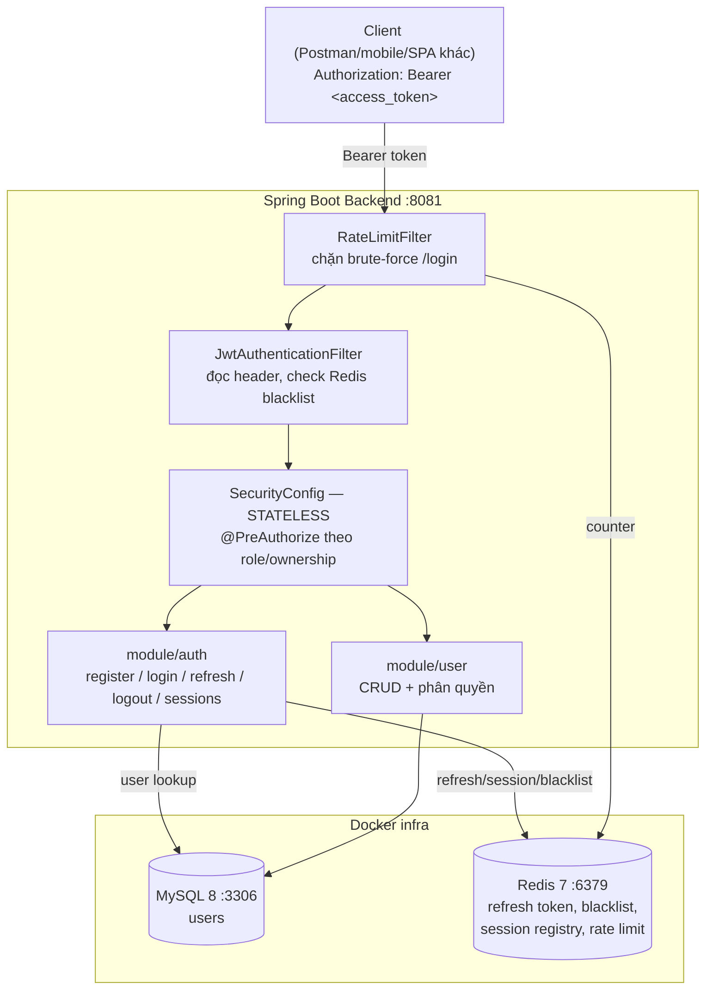

# Plan — Project 10: Spring Boot Blueprint

> **Loại tài liệu:** Kế hoạch (roadmap) — phản ánh những gì **đã quyết định**, chưa implement. Cập nhật lần cuối 2026-07-28.
> Khác với project 01–09 (mỗi project học 1 chủ đề), project 10 là **blueprint production-ready**: khung chuẩn để luyện viết REST API hoàn chỉnh với Spring Data JPA + Spring Security, đủ tiêu chuẩn làm nền cho dự án thực tế (chuẩn bị cho project ở trường).

---

## 1. Mục tiêu & Tại sao

- Luyện lại toàn bộ vòng đời viết API production, nhưng lần này **tự thiết kế từ đầu** thay vì follow theo hướng dẫn từng bước như 01–09.
- Có nền C#/Node.js-Express từ trước → tập trung vào phần **idiom riêng của Spring** (Spring Security filter chain, Spring Data JPA, DI qua constructor) thay vì học lại khái niệm REST/JWT cơ bản.
- 2 module trọng tâm: **`user`** (quản lý user, CRUD chuẩn) và **`auth`** (authentication nâng cao — JWT access + refresh token có Redis, rotation, reuse detection, multi-device session).
- So với JWT của project 06/09 (refresh token lưu **MySQL**): project 10 chuyển sang lưu ở **Redis** — TTL tự động hết hạn, không cần cron purge job.

---

## 2. Tech Stack

| Concern | Lựa chọn | Ghi chú |
|---|---|---|
| Framework | Spring Boot 4.1.0 | Web MVC (`spring-boot-starter-webmvc`) |
| Ngôn ngữ | Java 21 | |
| Security | `spring-boot-starter-security` | JWT stateless thuần — **không** bật `oauth2Login()` (tránh session/CSRF churn đã gặp ở project 09) |
| JWT | JJWT `jjwt-api/impl/jackson` 0.13.0 | Đồng bộ version với project 09 |
| Persistence | `spring-boot-starter-data-jpa` + MySQL | Specification API cho filter động |
| Cache / Session store | `spring-boot-starter-data-redis` | Refresh token, access-token blacklist, rate limit, session registry |
| Validation | `spring-boot-starter-validation` | Bean Validation trên DTO |
| Docs | `springdoc-openapi-starter-webmvc-ui` | Swagger UI (Phase 8) |
| Migration | `flyway-mysql` | Thay `ddl-auto: update` (Phase 8) |
| Test | Testcontainers | Integration test trên MySQL/Redis thật (Phase 8) |

---

## 3. Cấu trúc package (đã chốt)

```
com/maaitlunghau/__spring_boot_blueprint/
├── common/            # dùng chung toàn app: ApiResponse, BaseEntity, PageResponse
├── config/             # SecurityConfig, CorsConfig, RedisConfig, OpenApiConfig
├── security/           # JwtService, JwtAuthenticationFilter, UserDetailsServiceImpl, entry point/access-denied handler
├── exception/          # GlobalExceptionHandler + custom exceptions
├── filter/             # RateLimitFilter
├── aspect/             # LoggingAspect (AOP)
├── scheduler/          # job định kỳ
├── util/               # RequestUtils, DateUtils
└── module/
    ├── auth/    {controller/v1, service, repository, dto/{request,response}}
    └── user/    {controller/v1, service/impl, repository/spec, entity, dto/{request,response}}
```

Quy ước: cái gì thuộc riêng 1 nghiệp vụ → `module/<tên>/`; cái gì dùng chung ≥ 2 module → package top-level. Interface service đặt thẳng trong `service/`, implementation trong `service/impl/`.

---

## 4. Kiến trúc tổng quan



---

## 5. Lộ trình theo Phase (tổng quan)

| Phase | Nội dung | Module |
|---|---|---|
| 1 | `User` entity + repository | user |
| 1+ | CRUD `user` hoàn chỉnh (list/filter/pagination, xem, tạo, sửa, xoá) — **chưa auth/phân quyền** | user |
| 2 | Register + login + JWT access token (chưa refresh, chưa Redis) | auth |
| 3 | Wire `SecurityConfig` + `JwtAuthenticationFilter` toàn app — STATELESS | auth |
| 4 | Refresh token + Redis + rotation/reuse detection | auth |
| 5 | Bổ sung `@PreAuthorize` theo role/ownership lên CRUD đã có từ Phase 1+ | user |
| 6 | Logout/blacklist, rate limit login, multi-device session | auth |
| 7 | Test (unit/slice/integration) cả 2 module | auth + user |
| 8 | Polish: Flyway, OpenAPI, Docker/CI | cả 2 |

Chi tiết từng phase — **từng step, full code** — ở mục 6 bên dưới.

---

## 6. Chi tiết từng Phase

### Phase 1 — `User` entity + repository

**Mục tiêu:** có data model nền tảng, chưa cần security.

**Step 1.1 — `common/entity/BaseEntity.java`**

> Dùng Lombok `@Getter` (không phải `@Data`) trên entity — `.claude/rules/tech-defaults.md` cấm `@Data` trên entity vì nó sinh `equals()`/`hashCode()` theo TẤT CẢ field (kể cả quan hệ lazy → trigger fetch ngoài ý muốn, dễ `StackOverflowError` với quan hệ 2 chiều) và sinh setter cho mọi field (phá encapsulation — entity trong blueprint này chỉ mutate qua domain method như `updateProfile()`/`changeRole()`, không có setter công khai). `@Getter` đơn thuần an toàn: chỉ sinh getter, không đụng `equals`/`hashCode`/constructor/setter.

```java
package com.maaitlunghau.__spring_boot_blueprint.common.entity;

import java.time.LocalDateTime;

import org.hibernate.annotations.CreationTimestamp;
import org.hibernate.annotations.UpdateTimestamp;

import jakarta.persistence.Column;
import jakarta.persistence.GeneratedValue;
import jakarta.persistence.GenerationType;
import jakarta.persistence.Id;
import jakarta.persistence.MappedSuperclass;
import jakarta.persistence.Version;
import lombok.Getter;

/** Mọi entity trong app extend từ đây — id, audit timestamp, optimistic locking dùng chung. */
@Getter
@MappedSuperclass
public abstract class BaseEntity {

    @Id
    @GeneratedValue(strategy = GenerationType.IDENTITY)
    private Long id;

    @CreationTimestamp
    @Column(updatable = false)
    private LocalDateTime createdAt;

    @UpdateTimestamp
    private LocalDateTime updatedAt;

    @Version
    private Long version;
}
```

**Step 1.2 — `module/user/entity/Role.java`**

```java
package com.maaitlunghau.__spring_boot_blueprint.module.user.entity;

public enum Role {
    ADMIN,
    USER
}
```

**Step 1.3 — `module/user/entity/User.java`**

`User` implements `UserDetails` trực tiếp (giống project 09) — không cần adapter riêng.

```java
package com.maaitlunghau.__spring_boot_blueprint.module.user.entity;

import java.util.Collection;
import java.util.List;

import org.springframework.security.core.GrantedAuthority;
import org.springframework.security.core.authority.SimpleGrantedAuthority;
import org.springframework.security.core.userdetails.UserDetails;

import com.maaitlunghau.__spring_boot_blueprint.common.entity.BaseEntity;

import jakarta.persistence.Column;
import jakarta.persistence.Entity;
import jakarta.persistence.EnumType;
import jakarta.persistence.Enumerated;
import jakarta.persistence.Table;
import lombok.Getter;

@Entity
@Table(name = "users")
@Getter // sinh getFullName()/getEmail()/getPassword()/getRole()/isEnabled() — KHÔNG sinh setter
public class User extends BaseEntity implements UserDetails {

    @Column(nullable = false, length = 100)
    private String fullName;

    @Column(nullable = false, unique = true, length = 255)
    private String email;

    @Column(nullable = false)
    private String password; // @Getter sinh getPassword() -> khớp thẳng chữ ký UserDetails.getPassword()

    @Enumerated(EnumType.STRING)
    @Column(nullable = false, length = 20)
    private Role role;

    @Column(nullable = false)
    private boolean enabled = true; // field boolean -> @Getter sinh isEnabled() -> khớp thẳng UserDetails.isEnabled()

    protected User() {} // JPA yêu cầu no-arg constructor

    public User(String fullName, String email, String password, Role role) {
        this.fullName = fullName;
        this.email = email;
        this.password = password;
        this.role = role;
    }

    public void updateProfile(String fullName) {
        this.fullName = fullName;
    }

    public void changeRole(Role role) {
        this.role = role;
    }

    // ===== UserDetails — 2 method dưới đây Lombok KHÔNG tự sinh được (tên khác field / cần tính toán) =====

    @Override
    public Collection<? extends GrantedAuthority> getAuthorities() {
        return List.of(new SimpleGrantedAuthority("ROLE_" + role.name()));
    }

    @Override
    public String getUsername() {
        return email; // UserDetails coi "username" là email — không có field riêng tên "username"
    }
}
```

> `isAccountNonExpired`/`isAccountNonLocked`/`isCredentialsNonExpired` của `UserDetails` có default method trả `true` sẵn — không cần override trừ khi cần khoá tài khoản sau này.
> `getPassword()` và `isEnabled()` không cần viết tay lẫn không cần `@Override` tường minh — method Lombok sinh ra từ field `password`/`enabled` đã đúng y hệt chữ ký mà interface `UserDetails` yêu cầu, tự động thoả mãn interface.

**Step 1.4 — `module/user/repository/UserRepository.java`**

```java
package com.maaitlunghau.__spring_boot_blueprint.module.user.repository;

import java.util.Optional;

import org.springframework.data.jpa.repository.JpaRepository;
import org.springframework.data.jpa.repository.JpaSpecificationExecutor;

import com.maaitlunghau.__spring_boot_blueprint.module.user.entity.User;

public interface UserRepository extends JpaRepository<User, Long>, JpaSpecificationExecutor<User> {
    Optional<User> findByEmail(String email);
    boolean existsByEmail(String email);
}
```

`JpaSpecificationExecutor` cần cho Phase 5 (filter động qua `Specification`) — thêm luôn từ đầu để khỏi phải sửa lại interface sau.

**Verify Phase 1:** `./mvnw compile` phải chạy sạch (chưa có bean nào phụ thuộc DB thật nên chưa cần MySQL chạy).

---

### Phase 1+ — CRUD `user` hoàn chỉnh (chưa có auth/phân quyền)

**Mục tiêu:** có `UserController`/`UserService`/`UserRepository` chạy được full CRUD (list + filter + pagination, xem, tạo, sửa, xoá) **trước khi** đụng tới JWT — dễ test bằng curl, và dùng chính endpoint tạo user ở đây để tạo tài khoản ADMIN đầu tiên (chưa có register/login nên không có cách nào khác để có user trong DB).

> **Vì sao cần `SecurityConfig` ngay từ Phase này:** `spring-boot-starter-security` đã có sẵn trong `pom.xml` từ đầu. Có dependency này trên classpath mà **chưa khai báo `SecurityFilterChain` bean nào** thì Spring Boot tự động bật cấu hình bảo mật mặc định — sinh 1 password ngẫu nhiên in ra console và chặn **toàn bộ** endpoint bằng Basic Auth. Muốn test CRUD không-auth ở phase này, bắt buộc phải có 1 `SecurityConfig` permit-all tối thiểu — đây cũng chính là bean `PasswordEncoder`/`AuthenticationManager` mà Phase 2 (login) cần, nên làm luôn từ đây, Phase 2 không phải quay lại sửa `SecurityConfig` nữa.

**Step 1+.1 — `config/SecurityConfig.java`** (tạm thời permit-all — Phase 3 siết lại thành STATELESS + JWT)

```java
package com.maaitlunghau.__spring_boot_blueprint.config;

import org.springframework.context.annotation.Bean;
import org.springframework.context.annotation.Configuration;
import org.springframework.security.authentication.AuthenticationManager;
import org.springframework.security.config.annotation.authentication.configuration.AuthenticationConfiguration;
import org.springframework.security.config.annotation.web.builders.HttpSecurity;
import org.springframework.security.config.annotation.web.configuration.EnableWebSecurity;
import org.springframework.security.crypto.bcrypt.BCryptPasswordEncoder;
import org.springframework.security.crypto.password.PasswordEncoder;
import org.springframework.security.web.SecurityFilterChain;
import org.springframework.security.web.csrf.CsrfConfigurer;

@Configuration
@EnableWebSecurity
public class SecurityConfig {

    @Bean
    SecurityFilterChain filterChain(HttpSecurity http) throws Exception {
        http
            .csrf(CsrfConfigurer::disable) // API thuần Bearer token, không dùng cookie -> không cần CSRF
            .authorizeHttpRequests(auth -> auth.anyRequest().permitAll()); // TODO Phase 3: siết lại
        return http.build();
    }

    @Bean
    public PasswordEncoder passwordEncoder() {
        return new BCryptPasswordEncoder();
    }

    @Bean
    public AuthenticationManager authenticationManager(AuthenticationConfiguration config) throws Exception {
        return config.getAuthenticationManager();
    }
}
```

**Step 1+.2 — Cập nhật lại toàn bộ `common/dto/ApiResponse.java`** — thêm factory `of()` để trả `status` HTTP khác 200 kèm data (vd `201 Created` kèm object vừa tạo)

```java
package com.maaitlunghau.__spring_boot_blueprint.common.dto;

import java.time.LocalDateTime;

public record ApiResponse<T>(int status, String message, T data, LocalDateTime timestamp) {

    public static <T> ApiResponse<T> ok(T data) {
        return new ApiResponse<>(200, "Success", data, LocalDateTime.now());
    }

    public static <T> ApiResponse<T> ok(String message, T data) {
        return new ApiResponse<>(200, message, data, LocalDateTime.now());
    }

    public static <T> ApiResponse<T> of(int status, String message, T data) {
        return new ApiResponse<>(status, message, data, LocalDateTime.now());
    }

    public static ApiResponse<Void> message(int status, String message) {
        return new ApiResponse<>(status, message, null, LocalDateTime.now());
    }
}
```

**Step 1+.3 — `common/dto/PageResponse.java`**

```java
package com.maaitlunghau.__spring_boot_blueprint.common.dto;

import java.util.List;

import org.springframework.data.domain.Page;

public record PageResponse<T>(
    List<T> content,
    int page,
    int size,
    long totalElements,
    int totalPages,
    boolean last
) {
    public static <T> PageResponse<T> from(Page<T> page) {
        return new PageResponse<>(
            page.getContent(), page.getNumber(), page.getSize(),
            page.getTotalElements(), page.getTotalPages(), page.isLast()
        );
    }
}
```

**Step 1+.4 — `module/user/dto/response/UserResponse.java`**

```java
package com.maaitlunghau.__spring_boot_blueprint.module.user.dto.response;

import java.time.LocalDateTime;

import com.maaitlunghau.__spring_boot_blueprint.module.user.entity.Role;
import com.maaitlunghau.__spring_boot_blueprint.module.user.entity.User;

public record UserResponse(
    Long id,
    String fullName,
    String email,
    String imageUrl,
    Role role,
    boolean enabled,
    LocalDateTime createdAt
) {
    public static UserResponse from(User user) {
        return new UserResponse(
            user.getId(), user.getFullName(), user.getEmail(), user.getImageUrl(),
            user.getRole(), user.isEnabled(), user.getCreatedAt()
        );
    }
}
```

> `imageUrl` có trong response vì entity `User` của bạn đã bổ sung field này ở Phase 1 — nếu bạn không có field đó thì bỏ dòng tương ứng.

**Step 1+.5 — `module/user/dto/request/CreateUserRequest.java`**

```java
package com.maaitlunghau.__spring_boot_blueprint.module.user.dto.request;

import jakarta.validation.constraints.Email;
import jakarta.validation.constraints.NotBlank;
import jakarta.validation.constraints.NotNull;
import jakarta.validation.constraints.Size;

import com.maaitlunghau.__spring_boot_blueprint.module.user.entity.Role;

public record CreateUserRequest(
    @NotBlank(message = "Họ tên là bắt buộc") String fullName,
    @Email(message = "Email không hợp lệ") @NotBlank(message = "Email là bắt buộc") String email,
    @NotBlank(message = "Mật khẩu là bắt buộc") @Size(min = 6, message = "Mật khẩu tối thiểu 6 ký tự") String password,
    @NotNull(message = "role là bắt buộc") Role role
) {}
```

**Step 1+.6 — `module/user/dto/request/UpdateUserRequest.java`**

```java
package com.maaitlunghau.__spring_boot_blueprint.module.user.dto.request;

import jakarta.validation.constraints.NotBlank;
import jakarta.validation.constraints.NotNull;

import com.maaitlunghau.__spring_boot_blueprint.module.user.entity.Role;

public record UpdateUserRequest(
    @NotBlank(message = "Họ tên là bắt buộc") String fullName,
    String imageUrl,
    @NotNull(message = "role là bắt buộc") Role role
) {}
```

> DTO này là bản "sửa tất cả trong 1" tạm thời — vì Phase này chưa có khái niệm "chính chủ" (không có `@AuthenticationPrincipal`, chưa có JWT). Phase 5 sẽ **thay thế** file này bằng 2 DTO chuyên biệt hơn (`UpdateProfileRequest` cho chính chủ, `UpdateUserRoleRequest` cho admin) — lúc đó nhớ xoá `UpdateUserRequest.java` đi, không dùng nữa.

**Step 1+.7 — Cập nhật lại toàn bộ `module/user/repository/UserRepository.java`** — thêm `countByRole` (cần cho rule "không xoá/hạ quyền ADMIN cuối cùng")

```java
package com.maaitlunghau.__spring_boot_blueprint.module.user.repository;

import java.util.Optional;

import org.springframework.data.jpa.repository.JpaRepository;
import org.springframework.data.jpa.repository.JpaSpecificationExecutor;

import com.maaitlunghau.__spring_boot_blueprint.module.user.entity.Role;
import com.maaitlunghau.__spring_boot_blueprint.module.user.entity.User;

public interface UserRepository extends JpaRepository<User, Long>, JpaSpecificationExecutor<User> {
    Optional<User> findByEmail(String email);
    boolean existsByEmail(String email);
    long countByRole(Role role);
}
```

**Step 1+.8 — `module/user/repository/spec/UserSpecifications.java`**

```java
package com.maaitlunghau.__spring_boot_blueprint.module.user.repository.spec;

import org.springframework.data.jpa.domain.Specification;
import org.springframework.util.StringUtils;

import com.maaitlunghau.__spring_boot_blueprint.module.user.entity.Role;
import com.maaitlunghau.__spring_boot_blueprint.module.user.entity.User;

public final class UserSpecifications {

    private UserSpecifications() {}

    public static Specification<User> keywordIn(String keyword) {
        return (root, query, cb) -> {
            if (!StringUtils.hasText(keyword)) return cb.conjunction();
            String pattern = "%" + keyword.toLowerCase() + "%";
            return cb.or(
                cb.like(cb.lower(root.get("fullName")), pattern),
                cb.like(cb.lower(root.get("email")), pattern)
            );
        };
    }

    public static Specification<User> hasRole(Role role) {
        return (root, query, cb) -> role == null ? cb.conjunction() : cb.equal(root.get("role"), role);
    }
}
```

**Step 1+.9 — `module/user/service/UserService.java`** (interface)

```java
package com.maaitlunghau.__spring_boot_blueprint.module.user.service;

import org.springframework.data.domain.Pageable;

import com.maaitlunghau.__spring_boot_blueprint.common.dto.PageResponse;
import com.maaitlunghau.__spring_boot_blueprint.module.user.dto.request.CreateUserRequest;
import com.maaitlunghau.__spring_boot_blueprint.module.user.dto.request.UpdateUserRequest;
import com.maaitlunghau.__spring_boot_blueprint.module.user.dto.response.UserResponse;
import com.maaitlunghau.__spring_boot_blueprint.module.user.entity.Role;

public interface UserService {
    PageResponse<UserResponse> search(String keyword, Role role, Pageable pageable);
    UserResponse getById(Long id);
    UserResponse create(CreateUserRequest request);
    UserResponse update(Long id, UpdateUserRequest request);
    void delete(Long id);
}
```

**Step 1+.10 — `module/user/service/impl/UserServiceImpl.java`**

```java
package com.maaitlunghau.__spring_boot_blueprint.module.user.service.impl;

import org.springframework.data.domain.Page;
import org.springframework.data.domain.Pageable;
import org.springframework.security.crypto.password.PasswordEncoder;
import org.springframework.stereotype.Service;
import org.springframework.transaction.annotation.Transactional;

import com.maaitlunghau.__spring_boot_blueprint.common.dto.PageResponse;
import com.maaitlunghau.__spring_boot_blueprint.exception.BadRequestException;
import com.maaitlunghau.__spring_boot_blueprint.exception.DuplicateResourceException;
import com.maaitlunghau.__spring_boot_blueprint.exception.ResourceNotFoundException;
import com.maaitlunghau.__spring_boot_blueprint.module.user.dto.request.CreateUserRequest;
import com.maaitlunghau.__spring_boot_blueprint.module.user.dto.request.UpdateUserRequest;
import com.maaitlunghau.__spring_boot_blueprint.module.user.dto.response.UserResponse;
import com.maaitlunghau.__spring_boot_blueprint.module.user.entity.Role;
import com.maaitlunghau.__spring_boot_blueprint.module.user.entity.User;
import com.maaitlunghau.__spring_boot_blueprint.module.user.repository.UserRepository;
import com.maaitlunghau.__spring_boot_blueprint.module.user.repository.spec.UserSpecifications;
import com.maaitlunghau.__spring_boot_blueprint.module.user.service.UserService;

@Service
@Transactional(readOnly = true)
public class UserServiceImpl implements UserService {

    private final UserRepository userRepository;
    private final PasswordEncoder passwordEncoder;

    public UserServiceImpl(UserRepository userRepository, PasswordEncoder passwordEncoder) {
        this.userRepository = userRepository;
        this.passwordEncoder = passwordEncoder;
    }

    @Override
    public PageResponse<UserResponse> search(String keyword, Role role, Pageable pageable) {
        Page<User> page = userRepository.findAll(
            UserSpecifications.keywordIn(keyword).and(UserSpecifications.hasRole(role)), pageable);
        return PageResponse.from(page.map(UserResponse::from));
    }

    @Override
    public UserResponse getById(Long id) {
        return UserResponse.from(findUserOrThrow(id));
    }

    @Override
    @Transactional
    public UserResponse create(CreateUserRequest request) {
        if (userRepository.existsByEmail(request.email())) {
            throw new DuplicateResourceException("Email đã tồn tại: " + request.email());
        }
        User user = new User(request.fullName(), request.email(),
            passwordEncoder.encode(request.password()), request.role());
        return UserResponse.from(userRepository.save(user));
    }

    @Override
    @Transactional
    public UserResponse update(Long id, UpdateUserRequest request) {
        User user = findUserOrThrow(id);
        if (user.getRole() == Role.ADMIN && request.role() != Role.ADMIN
                && userRepository.countByRole(Role.ADMIN) <= 1) {
            throw new BadRequestException("Không thể hạ quyền ADMIN cuối cùng trong hệ thống");
        }
        user.updateProfile(request.fullName(), request.imageUrl());
        user.changeRole(request.role());
        return UserResponse.from(user); // dirty checking tự flush khi transaction commit
    }

    @Override
    @Transactional
    public void delete(Long id) {
        User user = findUserOrThrow(id);
        if (user.getRole() == Role.ADMIN && userRepository.countByRole(Role.ADMIN) <= 1) {
            throw new BadRequestException("Không thể xoá ADMIN cuối cùng trong hệ thống");
        }
        userRepository.delete(user);
    }

    private User findUserOrThrow(Long id) {
        return userRepository.findById(id)
            .orElseThrow(() -> new ResourceNotFoundException("User", id));
    }
}
```

**Step 1+.11 — `module/user/controller/v1/UserController.java`**

```java
package com.maaitlunghau.__spring_boot_blueprint.module.user.controller.v1;

import org.springframework.data.domain.Pageable;
import org.springframework.http.HttpStatus;
import org.springframework.http.ResponseEntity;
import org.springframework.web.bind.annotation.DeleteMapping;
import org.springframework.web.bind.annotation.GetMapping;
import org.springframework.web.bind.annotation.PatchMapping;
import org.springframework.web.bind.annotation.PathVariable;
import org.springframework.web.bind.annotation.PostMapping;
import org.springframework.web.bind.annotation.RequestBody;
import org.springframework.web.bind.annotation.RequestMapping;
import org.springframework.web.bind.annotation.RequestParam;
import org.springframework.web.bind.annotation.RestController;

import com.maaitlunghau.__spring_boot_blueprint.common.dto.ApiResponse;
import com.maaitlunghau.__spring_boot_blueprint.common.dto.PageResponse;
import com.maaitlunghau.__spring_boot_blueprint.module.user.dto.request.CreateUserRequest;
import com.maaitlunghau.__spring_boot_blueprint.module.user.dto.request.UpdateUserRequest;
import com.maaitlunghau.__spring_boot_blueprint.module.user.dto.response.UserResponse;
import com.maaitlunghau.__spring_boot_blueprint.module.user.entity.Role;
import com.maaitlunghau.__spring_boot_blueprint.module.user.service.UserService;

import jakarta.validation.Valid;

/**
 * CHƯA có phân quyền — mọi endpoint đang public tạm thời vì chưa có JWT filter
 * (Phase 3) lẫn @AuthenticationPrincipal. Phase 5 sẽ quay lại đúng file này,
 * thêm @PreAuthorize và tách endpoint /me (chính chủ) khỏi thao tác admin.
 */
@RestController
@RequestMapping("/api/v1/users")
public class UserController {

    private final UserService userService;

    public UserController(UserService userService) {
        this.userService = userService;
    }

    @GetMapping
    public ResponseEntity<ApiResponse<PageResponse<UserResponse>>> search(
            @RequestParam(required = false) String keyword,
            @RequestParam(required = false) Role role,
            Pageable pageable) {
        return ResponseEntity.ok(ApiResponse.ok(userService.search(keyword, role, pageable)));
    }

    @GetMapping("/{id}")
    public ResponseEntity<ApiResponse<UserResponse>> getById(@PathVariable Long id) {
        return ResponseEntity.ok(ApiResponse.ok(userService.getById(id)));
    }

    @PostMapping
    public ResponseEntity<ApiResponse<UserResponse>> create(@Valid @RequestBody CreateUserRequest request) {
        UserResponse created = userService.create(request);
        return ResponseEntity.status(HttpStatus.CREATED).body(ApiResponse.of(201, "Tạo user thành công", created));
    }

    @PatchMapping("/{id}")
    public ResponseEntity<ApiResponse<UserResponse>> update(@PathVariable Long id,
                                                              @Valid @RequestBody UpdateUserRequest request) {
        return ResponseEntity.ok(ApiResponse.ok("Cập nhật thành công", userService.update(id, request)));
    }

    @DeleteMapping("/{id}")
    public ResponseEntity<ApiResponse<Void>> delete(@PathVariable Long id) {
        userService.delete(id);
        return ResponseEntity.ok(ApiResponse.message(200, "Xoá thành công"));
    }
}
```

**Verify Phase 1+:** `./mvnw spring-boot:run` (cần MySQL sống). Tạo user ADMIN đầu tiên (chưa có register nên đây là cách duy nhất để có data):

```bash
curl -X POST localhost:8081/api/v1/users -H "Content-Type: application/json" \
  -d '{"fullName":"Admin","email":"admin@example.com","password":"password123","role":"ADMIN"}'

curl localhost:8081/api/v1/users
curl "localhost:8081/api/v1/users?keyword=admin&page=0&size=10"
```

Tất cả phải trả `200`/`201` không cần header `Authorization` (vì `SecurityConfig` đang permit-all).

---

### Phase 2 — Register + login + JWT access token

**Mục tiêu:** có auth chạy end-to-end bằng JWT access token thuần (chưa refresh, chưa Redis).

**Step 2.1 — Thêm dependency JJWT vào `pom.xml`**

```xml
<dependency>
    <groupId>io.jsonwebtoken</groupId>
    <artifactId>jjwt-api</artifactId>
    <version>0.13.0</version>
</dependency>
<dependency>
    <groupId>io.jsonwebtoken</groupId>
    <artifactId>jjwt-impl</artifactId>
    <version>0.13.0</version>
    <scope>runtime</scope>
</dependency>
<dependency>
    <groupId>io.jsonwebtoken</groupId>
    <artifactId>jjwt-jackson</artifactId>
    <version>0.13.0</version>
    <scope>runtime</scope>
</dependency>
```

**Step 2.2 — Thêm cấu hình JWT vào `application.yml`**

```yaml
app:
  jwt:
    secret: "ChangeThisToARandomSecretAtLeast32BytesLongForHS256!!"
    access-token-expiration: 900000       # 15 phút (ms)
    refresh-token-expiration: 604800000   # 7 ngày (ms) — dùng từ Phase 4
```

> `secret` chỉ để chạy dev. Khi lên `application-prod.yml` (Phase 8) phải đọc từ biến môi trường, không hardcode.

**Step 2.3 — `common/dto/ApiResponse.java`**

Envelope response dùng chung toàn app.

```java
package com.maaitlunghau.__spring_boot_blueprint.common.dto;

import java.time.LocalDateTime;

public record ApiResponse<T>(int status, String message, T data, LocalDateTime timestamp) {

    public static <T> ApiResponse<T> ok(T data) {
        return new ApiResponse<>(200, "Success", data, LocalDateTime.now());
    }

    public static <T> ApiResponse<T> ok(String message, T data) {
        return new ApiResponse<>(200, message, data, LocalDateTime.now());
    }

    public static ApiResponse<Void> message(int status, String message) {
        return new ApiResponse<>(status, message, null, LocalDateTime.now());
    }
}
```

**Step 2.4 — Exception classes: `exception/AppException.java`**

```java
package com.maaitlunghau.__spring_boot_blueprint.exception;

public abstract class AppException extends RuntimeException {
    protected AppException(String message) {
        super(message);
    }
}
```

**`exception/ResourceNotFoundException.java`**

```java
package com.maaitlunghau.__spring_boot_blueprint.exception;

public class ResourceNotFoundException extends AppException {
    public ResourceNotFoundException(String resource, Object identifier) {
        super(resource + " không tồn tại: " + identifier);
    }
}
```

**`exception/DuplicateResourceException.java`**

```java
package com.maaitlunghau.__spring_boot_blueprint.exception;

public class DuplicateResourceException extends AppException {
    public DuplicateResourceException(String message) {
        super(message);
    }
}
```

**`exception/BadRequestException.java`**

```java
package com.maaitlunghau.__spring_boot_blueprint.exception;

public class BadRequestException extends AppException {
    public BadRequestException(String message) {
        super(message);
    }
}
```

**Step 2.5 — `exception/GlobalExceptionHandler.java`**

```java
package com.maaitlunghau.__spring_boot_blueprint.exception;

import java.util.stream.Collectors;

import org.springframework.http.HttpStatus;
import org.springframework.http.ResponseEntity;
import org.springframework.security.access.AccessDeniedException;
import org.springframework.security.authentication.BadCredentialsException;
import org.springframework.security.authentication.DisabledException;
import org.springframework.web.bind.MethodArgumentNotValidException;
import org.springframework.web.bind.annotation.ExceptionHandler;
import org.springframework.web.bind.annotation.RestControllerAdvice;

import com.maaitlunghau.__spring_boot_blueprint.common.dto.ApiResponse;

@RestControllerAdvice
public class GlobalExceptionHandler {

    @ExceptionHandler(ResourceNotFoundException.class)
    public ResponseEntity<ApiResponse<Void>> handleNotFound(ResourceNotFoundException ex) {
        return ResponseEntity.status(HttpStatus.NOT_FOUND).body(ApiResponse.message(404, ex.getMessage()));
    }

    @ExceptionHandler(DuplicateResourceException.class)
    public ResponseEntity<ApiResponse<Void>> handleDuplicate(DuplicateResourceException ex) {
        return ResponseEntity.status(HttpStatus.CONFLICT).body(ApiResponse.message(409, ex.getMessage()));
    }

    @ExceptionHandler(BadRequestException.class)
    public ResponseEntity<ApiResponse<Void>> handleBadRequest(BadRequestException ex) {
        return ResponseEntity.badRequest().body(ApiResponse.message(400, ex.getMessage()));
    }

    @ExceptionHandler(MethodArgumentNotValidException.class)
    public ResponseEntity<ApiResponse<Void>> handleValidation(MethodArgumentNotValidException ex) {
        String message = ex.getBindingResult().getFieldErrors().stream()
            .map(e -> e.getField() + ": " + e.getDefaultMessage())
            .collect(Collectors.joining("; "));
        return ResponseEntity.badRequest().body(ApiResponse.message(400, message));
    }

    @ExceptionHandler({BadCredentialsException.class, DisabledException.class})
    public ResponseEntity<ApiResponse<Void>> handleAuthFailure(Exception ex) {
        return ResponseEntity.status(HttpStatus.UNAUTHORIZED).body(ApiResponse.message(401, "Sai email hoặc mật khẩu"));
    }

    @ExceptionHandler(AccessDeniedException.class)
    public ResponseEntity<ApiResponse<Void>> handleAccessDenied(AccessDeniedException ex) {
        return ResponseEntity.status(HttpStatus.FORBIDDEN).body(ApiResponse.message(403, "Không có quyền truy cập"));
    }

    @ExceptionHandler(Exception.class)
    public ResponseEntity<ApiResponse<Void>> handleGeneral(Exception ex) {
        return ResponseEntity.internalServerError().body(ApiResponse.message(500, "Lỗi hệ thống"));
    }
}
```

**Step 2.6 — DTO auth: `module/auth/dto/request/RegisterRequest.java`**

```java
package com.maaitlunghau.__spring_boot_blueprint.module.auth.dto.request;

import jakarta.validation.constraints.Email;
import jakarta.validation.constraints.NotBlank;
import jakarta.validation.constraints.Size;

public record RegisterRequest(
    @NotBlank(message = "Họ tên là bắt buộc") String fullName,
    @Email(message = "Email không hợp lệ") @NotBlank(message = "Email là bắt buộc") String email,
    @NotBlank(message = "Mật khẩu là bắt buộc") @Size(min = 6, message = "Mật khẩu tối thiểu 6 ký tự") String password
) {}
```

**`module/auth/dto/request/LoginRequest.java`**

```java
package com.maaitlunghau.__spring_boot_blueprint.module.auth.dto.request;

import jakarta.validation.constraints.Email;
import jakarta.validation.constraints.NotBlank;

public record LoginRequest(
    @Email(message = "Email không hợp lệ") @NotBlank(message = "Email là bắt buộc") String email,
    @NotBlank(message = "Mật khẩu là bắt buộc") String password
) {}
```

**`module/auth/dto/response/AuthResponse.java`** (bản tối giản — Phase 4 sẽ cập nhật lại thêm `refreshToken`)

```java
package com.maaitlunghau.__spring_boot_blueprint.module.auth.dto.response;

public record AuthResponse(String accessToken, long expiresIn) {}
```

**Step 2.7 — `security/JwtService.java`**

```java
package com.maaitlunghau.__spring_boot_blueprint.security;

import java.nio.charset.StandardCharsets;
import java.time.Instant;
import java.util.Date;
import java.util.UUID;

import javax.crypto.SecretKey;

import org.springframework.beans.factory.annotation.Value;
import org.springframework.stereotype.Service;

import com.maaitlunghau.__spring_boot_blueprint.module.user.entity.User;

import io.jsonwebtoken.Claims;
import io.jsonwebtoken.JwtException;
import io.jsonwebtoken.Jwts;
import io.jsonwebtoken.security.Keys;

@Service
public class JwtService {

    private final SecretKey key;
    private final long accessTokenExpirationMs;

    public JwtService(@Value("${app.jwt.secret}") String secret,
                       @Value("${app.jwt.access-token-expiration}") long accessTokenExpirationMs) {
        this.key = Keys.hmacShaKeyFor(secret.getBytes(StandardCharsets.UTF_8));
        this.accessTokenExpirationMs = accessTokenExpirationMs;
    }

    public String generateAccessToken(User user) {
        Instant now = Instant.now();
        return Jwts.builder()
            .subject(user.getEmail())
            .id(UUID.randomUUID().toString())
            .claim("role", user.getRole().name())
            .issuedAt(Date.from(now))
            .expiration(Date.from(now.plusMillis(accessTokenExpirationMs)))
            .signWith(key)
            .compact();
    }

    public String extractUsername(String token) {
        return extractClaims(token).getSubject();
    }

    public String extractJti(String token) {
        return extractClaims(token).getId();
    }

    public boolean isTokenValid(String token, String expectedUsername) {
        try {
            Claims claims = extractClaims(token);
            return claims.getSubject().equals(expectedUsername) && claims.getExpiration().after(new Date());
        } catch (JwtException | IllegalArgumentException e) {
            return false;
        }
    }

    public long remainingSeconds(String token) {
        Date exp = extractClaims(token).getExpiration();
        return Math.max(0, (exp.getTime() - System.currentTimeMillis()) / 1000);
    }

    public long getAccessTokenExpirationSeconds() {
        return accessTokenExpirationMs / 1000;
    }

    private Claims extractClaims(String token) {
        return Jwts.parser().verifyWith(key).build().parseSignedClaims(token).getPayload();
    }
}
```

**Step 2.8 — `security/UserDetailsServiceImpl.java`**

```java
package com.maaitlunghau.__spring_boot_blueprint.security;

import org.springframework.security.core.userdetails.UserDetails;
import org.springframework.security.core.userdetails.UserDetailsService;
import org.springframework.security.core.userdetails.UsernameNotFoundException;
import org.springframework.stereotype.Service;

import com.maaitlunghau.__spring_boot_blueprint.module.user.repository.UserRepository;

@Service
public class UserDetailsServiceImpl implements UserDetailsService {

    private final UserRepository userRepository;

    public UserDetailsServiceImpl(UserRepository userRepository) {
        this.userRepository = userRepository;
    }

    @Override
    public UserDetails loadUserByUsername(String email) throws UsernameNotFoundException {
        return userRepository.findByEmail(email)
            .orElseThrow(() -> new UsernameNotFoundException("User not found: " + email));
    }
}
```

**Step 2.9 — `module/auth/service/AuthService.java`** (bản tối giản — Phase 4 cập nhật lại)

```java
package com.maaitlunghau.__spring_boot_blueprint.module.auth.service;

import org.springframework.security.authentication.AuthenticationManager;
import org.springframework.security.authentication.UsernamePasswordAuthenticationToken;
import org.springframework.security.crypto.password.PasswordEncoder;
import org.springframework.stereotype.Service;
import org.springframework.transaction.annotation.Transactional;

import com.maaitlunghau.__spring_boot_blueprint.exception.DuplicateResourceException;
import com.maaitlunghau.__spring_boot_blueprint.exception.ResourceNotFoundException;
import com.maaitlunghau.__spring_boot_blueprint.module.auth.dto.request.LoginRequest;
import com.maaitlunghau.__spring_boot_blueprint.module.auth.dto.request.RegisterRequest;
import com.maaitlunghau.__spring_boot_blueprint.module.auth.dto.response.AuthResponse;
import com.maaitlunghau.__spring_boot_blueprint.module.user.entity.Role;
import com.maaitlunghau.__spring_boot_blueprint.module.user.entity.User;
import com.maaitlunghau.__spring_boot_blueprint.module.user.repository.UserRepository;
import com.maaitlunghau.__spring_boot_blueprint.security.JwtService;

@Service
@Transactional(readOnly = true)
public class AuthService {

    private final UserRepository userRepository;
    private final PasswordEncoder passwordEncoder;
    private final AuthenticationManager authenticationManager;
    private final JwtService jwtService;

    public AuthService(UserRepository userRepository,
                        PasswordEncoder passwordEncoder,
                        AuthenticationManager authenticationManager,
                        JwtService jwtService) {
        this.userRepository = userRepository;
        this.passwordEncoder = passwordEncoder;
        this.authenticationManager = authenticationManager;
        this.jwtService = jwtService;
    }

    @Transactional
    public void register(RegisterRequest request) {
        if (userRepository.existsByEmail(request.email())) {
            throw new DuplicateResourceException("Email đã tồn tại: " + request.email());
        }
        User user = new User(request.fullName(), request.email(),
            passwordEncoder.encode(request.password()), Role.USER);
        userRepository.save(user);
    }

    public AuthResponse login(LoginRequest request) {
        authenticationManager.authenticate(
            new UsernamePasswordAuthenticationToken(request.email(), request.password()));

        User user = userRepository.findByEmail(request.email())
            .orElseThrow(() -> new ResourceNotFoundException("User", request.email()));

        String accessToken = jwtService.generateAccessToken(user);
        return new AuthResponse(accessToken, jwtService.getAccessTokenExpirationSeconds());
    }
}
```

**Step 2.10 — `module/auth/controller/v1/AuthController.java`** (bản tối giản — Phase 4/6 thêm endpoint)

```java
package com.maaitlunghau.__spring_boot_blueprint.module.auth.controller.v1;

import org.springframework.http.HttpStatus;
import org.springframework.http.ResponseEntity;
import org.springframework.web.bind.annotation.PostMapping;
import org.springframework.web.bind.annotation.RequestBody;
import org.springframework.web.bind.annotation.RequestMapping;
import org.springframework.web.bind.annotation.RestController;

import com.maaitlunghau.__spring_boot_blueprint.common.dto.ApiResponse;
import com.maaitlunghau.__spring_boot_blueprint.module.auth.dto.request.LoginRequest;
import com.maaitlunghau.__spring_boot_blueprint.module.auth.dto.request.RegisterRequest;
import com.maaitlunghau.__spring_boot_blueprint.module.auth.dto.response.AuthResponse;
import com.maaitlunghau.__spring_boot_blueprint.module.auth.service.AuthService;

import jakarta.validation.Valid;

@RestController
@RequestMapping("/api/v1/auth")
public class AuthController {

    private final AuthService authService;

    public AuthController(AuthService authService) {
        this.authService = authService;
    }

    @PostMapping("/register")
    public ResponseEntity<ApiResponse<Void>> register(@Valid @RequestBody RegisterRequest request) {
        authService.register(request);
        return ResponseEntity.status(HttpStatus.CREATED).body(ApiResponse.message(201, "Đăng ký thành công"));
    }

    @PostMapping("/login")
    public ResponseEntity<ApiResponse<AuthResponse>> login(@Valid @RequestBody LoginRequest request) {
        AuthResponse tokens = authService.login(request);
        return ResponseEntity.ok(ApiResponse.ok("Đăng nhập thành công", tokens));
    }
}
```

> `SecurityConfig` (tạm permit-all) đã được tạo sẵn từ **Phase 1+** (vì CRUD user ở Phase 1+ cũng cần chạy không-auth) — không cần làm lại ở đây. `passwordEncoder()` và `authenticationManager()` bean trong đó chính là 2 bean `AuthService` ở trên đang cần.

**Verify Phase 2:** chạy `./mvnw spring-boot:run` (cần MySQL sống), test bằng curl:

```bash
curl -X POST localhost:8081/api/v1/auth/register -H "Content-Type: application/json" \
  -d '{"fullName":"Alice","email":"alice@example.com","password":"password123"}'

curl -X POST localhost:8081/api/v1/auth/login -H "Content-Type: application/json" \
  -d '{"email":"alice@example.com","password":"password123"}'
```

---

### Phase 3 — Wire SecurityConfig + JwtAuthenticationFilter (STATELESS)

**Mục tiêu:** từ giờ endpoint không nằm trong danh sách permit-all sẽ yêu cầu Bearer token hợp lệ.

**Step 3.1 — `security/JwtAuthenticationFilter.java`**

```java
package com.maaitlunghau.__spring_boot_blueprint.security;

import java.io.IOException;

import org.springframework.security.authentication.UsernamePasswordAuthenticationToken;
import org.springframework.security.core.context.SecurityContextHolder;
import org.springframework.security.core.userdetails.UserDetails;
import org.springframework.security.core.userdetails.UserDetailsService;
import org.springframework.security.web.authentication.WebAuthenticationDetailsSource;
import org.springframework.stereotype.Component;
import org.springframework.web.filter.OncePerRequestFilter;

import io.jsonwebtoken.JwtException;
import jakarta.servlet.FilterChain;
import jakarta.servlet.ServletException;
import jakarta.servlet.http.HttpServletRequest;
import jakarta.servlet.http.HttpServletResponse;

/**
 * Chạy MỘT LẦN mỗi request: đọc access token từ header Authorization, xác thực, nạp
 * danh tính vào SecurityContext. Không tự trả 401/403 — để EntryPoint/AccessDeniedHandler lo.
 */
@Component
public class JwtAuthenticationFilter extends OncePerRequestFilter {

    private final JwtService jwtService;
    private final UserDetailsService userDetailsService;

    public JwtAuthenticationFilter(JwtService jwtService, UserDetailsService userDetailsService) {
        this.jwtService = jwtService;
        this.userDetailsService = userDetailsService;
    }

    @Override
    protected void doFilterInternal(HttpServletRequest request, HttpServletResponse response,
                                     FilterChain filterChain) throws ServletException, IOException {
        String token = resolveToken(request);
        if (token == null) {
            filterChain.doFilter(request, response);
            return;
        }
        try {
            String username = jwtService.extractUsername(token);
            if (username != null && SecurityContextHolder.getContext().getAuthentication() == null) {
                UserDetails userDetails = userDetailsService.loadUserByUsername(username);
                if (jwtService.isTokenValid(token, userDetails.getUsername())) {
                    var auth = new UsernamePasswordAuthenticationToken(
                        userDetails, null, userDetails.getAuthorities());
                    auth.setDetails(new WebAuthenticationDetailsSource().buildDetails(request));
                    SecurityContextHolder.getContext().setAuthentication(auth);
                }
            }
        } catch (JwtException | IllegalArgumentException ex) {
            SecurityContextHolder.clearContext();
        }
        filterChain.doFilter(request, response);
    }

    private String resolveToken(HttpServletRequest request) {
        String header = request.getHeader("Authorization");
        if (header != null && header.startsWith("Bearer ")) {
            return header.substring(7);
        }
        return null;
    }
}
```

**Step 3.2 — `security/CustomAuthenticationEntryPoint.java`** (401 handler)

```java
package com.maaitlunghau.__spring_boot_blueprint.security;

import java.io.IOException;

import org.springframework.http.MediaType;
import org.springframework.security.core.AuthenticationException;
import org.springframework.security.web.AuthenticationEntryPoint;
import org.springframework.stereotype.Component;

import com.fasterxml.jackson.databind.ObjectMapper;
import com.maaitlunghau.__spring_boot_blueprint.common.dto.ApiResponse;

import jakarta.servlet.http.HttpServletRequest;
import jakarta.servlet.http.HttpServletResponse;

@Component
public class CustomAuthenticationEntryPoint implements AuthenticationEntryPoint {

    private final ObjectMapper objectMapper;

    public CustomAuthenticationEntryPoint(ObjectMapper objectMapper) {
        this.objectMapper = objectMapper;
    }

    @Override
    public void commence(HttpServletRequest request, HttpServletResponse response,
                          AuthenticationException authException) throws IOException {
        response.setStatus(HttpServletResponse.SC_UNAUTHORIZED);
        response.setContentType(MediaType.APPLICATION_JSON_VALUE);
        response.getWriter().write(
            objectMapper.writeValueAsString(ApiResponse.message(401, "Yêu cầu đăng nhập")));
    }
}
```

**Step 3.3 — `security/CustomAccessDeniedHandler.java`** (403 handler)

```java
package com.maaitlunghau.__spring_boot_blueprint.security;

import java.io.IOException;

import org.springframework.http.MediaType;
import org.springframework.security.access.AccessDeniedException;
import org.springframework.security.web.access.AccessDeniedHandler;
import org.springframework.stereotype.Component;

import com.fasterxml.jackson.databind.ObjectMapper;
import com.maaitlunghau.__spring_boot_blueprint.common.dto.ApiResponse;

import jakarta.servlet.http.HttpServletRequest;
import jakarta.servlet.http.HttpServletResponse;

@Component
public class CustomAccessDeniedHandler implements AccessDeniedHandler {

    private final ObjectMapper objectMapper;

    public CustomAccessDeniedHandler(ObjectMapper objectMapper) {
        this.objectMapper = objectMapper;
    }

    @Override
    public void handle(HttpServletRequest request, HttpServletResponse response,
                        AccessDeniedException accessDeniedException) throws IOException {
        response.setStatus(HttpServletResponse.SC_FORBIDDEN);
        response.setContentType(MediaType.APPLICATION_JSON_VALUE);
        response.getWriter().write(
            objectMapper.writeValueAsString(ApiResponse.message(403, "Không có quyền truy cập")));
    }
}
```

**Step 3.4 — `config/CorsConfig.java`**

```java
package com.maaitlunghau.__spring_boot_blueprint.config;

import java.util.List;

import org.springframework.context.annotation.Bean;
import org.springframework.context.annotation.Configuration;
import org.springframework.web.cors.CorsConfiguration;
import org.springframework.web.cors.CorsConfigurationSource;
import org.springframework.web.cors.UrlBasedCorsConfigurationSource;

/**
 * API thuần dùng Bearer token (không cookie) -> allowCredentials=false, có thể
 * dùng allowedOriginPatterns rộng hơn project 09 (project 09 dùng cookie nên
 * bắt buộc phải khai origin cụ thể khi allowCredentials=true).
 */
@Configuration
public class CorsConfig {

    @Bean
    public CorsConfigurationSource corsConfigurationSource() {
        CorsConfiguration config = new CorsConfiguration();
        config.setAllowedOriginPatterns(List.of("*"));
        config.setAllowedMethods(List.of("GET", "POST", "PUT", "PATCH", "DELETE", "OPTIONS"));
        config.setAllowedHeaders(List.of("Authorization", "Content-Type"));
        config.setAllowCredentials(false);
        config.setMaxAge(3600L);

        UrlBasedCorsConfigurationSource source = new UrlBasedCorsConfigurationSource();
        source.registerCorsConfiguration("/**", config);
        return source;
    }
}
```

**Step 3.5 — Cập nhật lại toàn bộ `config/SecurityConfig.java`**

```java
package com.maaitlunghau.__spring_boot_blueprint.config;

import org.springframework.context.annotation.Bean;
import org.springframework.context.annotation.Configuration;
import org.springframework.security.authentication.AuthenticationManager;
import org.springframework.security.config.Customizer;
import org.springframework.security.config.annotation.authentication.configuration.AuthenticationConfiguration;
import org.springframework.security.config.annotation.method.configuration.EnableMethodSecurity;
import org.springframework.security.config.annotation.web.builders.HttpSecurity;
import org.springframework.security.config.annotation.web.configuration.EnableWebSecurity;
import org.springframework.security.config.http.SessionCreationPolicy;
import org.springframework.security.crypto.bcrypt.BCryptPasswordEncoder;
import org.springframework.security.crypto.password.PasswordEncoder;
import org.springframework.security.web.SecurityFilterChain;
import org.springframework.security.web.authentication.UsernamePasswordAuthenticationFilter;
import org.springframework.security.web.csrf.CsrfConfigurer;

import com.maaitlunghau.__spring_boot_blueprint.security.CustomAccessDeniedHandler;
import com.maaitlunghau.__spring_boot_blueprint.security.CustomAuthenticationEntryPoint;
import com.maaitlunghau.__spring_boot_blueprint.security.JwtAuthenticationFilter;

@Configuration
@EnableWebSecurity
@EnableMethodSecurity // bật @PreAuthorize — dùng từ Phase 5
public class SecurityConfig {

    private final JwtAuthenticationFilter jwtAuthenticationFilter;
    private final CustomAuthenticationEntryPoint authenticationEntryPoint;
    private final CustomAccessDeniedHandler accessDeniedHandler;

    public SecurityConfig(JwtAuthenticationFilter jwtAuthenticationFilter,
                           CustomAuthenticationEntryPoint authenticationEntryPoint,
                           CustomAccessDeniedHandler accessDeniedHandler) {
        this.jwtAuthenticationFilter = jwtAuthenticationFilter;
        this.authenticationEntryPoint = authenticationEntryPoint;
        this.accessDeniedHandler = accessDeniedHandler;
    }

    @Bean
    SecurityFilterChain filterChain(HttpSecurity http) throws Exception {
        http
            .csrf(CsrfConfigurer::disable)
            .cors(Customizer.withDefaults())
            .sessionManagement(s -> s.sessionCreationPolicy(SessionCreationPolicy.STATELESS))
            .authorizeHttpRequests(auth -> auth
                .requestMatchers("/api/v1/auth/**").permitAll()
                .requestMatchers("/swagger-ui/**", "/v3/api-docs/**").permitAll()
                .anyRequest().authenticated()
            )
            .exceptionHandling(e -> e
                .authenticationEntryPoint(authenticationEntryPoint)
                .accessDeniedHandler(accessDeniedHandler)
            )
            .addFilterBefore(jwtAuthenticationFilter, UsernamePasswordAuthenticationFilter.class);
        return http.build();
    }

    @Bean
    public PasswordEncoder passwordEncoder() {
        return new BCryptPasswordEncoder();
    }

    @Bean
    public AuthenticationManager authenticationManager(AuthenticationConfiguration config) throws Exception {
        return config.getAuthenticationManager();
    }
}
```

**Verify Phase 3:** gọi `GET /api/v1/users` (đã có từ Phase 1+) mà **không** có header `Authorization` → phải nhận `401` theo đúng shape `ApiResponse` (trước Phase 3 endpoint này permit-all nên sẽ trả `200`; sau Phase 3 phải đổi thành `401` — đây chính là cách xác nhận `SecurityConfig` đã siết đúng). Gọi lại kèm `Authorization: Bearer <access token>` từ `/login` (Phase 2) → phải nhận `200`.

---

### Phase 4 — Refresh token + Redis + rotation/reuse detection

**Mục tiêu:** login trả thêm `refreshToken`; endpoint `/refresh` rotate token, phát hiện reuse.

**Thiết kế Redis key:**

| Key pattern | Value | TTL | Mục đích |
|---|---|---|---|
| `auth:refresh:{tokenHash}` | JSON `{userId, sessionId, deviceInfo, ip, issuedAt, revoked}` | = refresh token lifetime | Xác thực + rotate khi gọi `/refresh` |
| `auth:sessions:{userId}` | SET các `sessionId` đang active | = refresh token lifetime | Liệt kê/thu hồi thiết bị của user (Phase 6) |

**Rotation + reuse detection:** token cũ khi bị rotate KHÔNG bị xoá ngay — được đánh dấu `revoked=true` và giữ lại **grace window 30 giây**. Nếu trong 30 giây đó có ai dùng lại chính token này → chắc chắn là request replay/token bị đánh cắp (client hợp lệ đã nhận token mới rồi, không có lý do gì dùng lại token cũ) → thu hồi toàn bộ session của user.

**Step 4.1 — Thêm dependency Redis vào `pom.xml`**

```xml
<dependency>
    <groupId>org.springframework.boot</groupId>
    <artifactId>spring-boot-starter-data-redis</artifactId>
</dependency>
```

**Step 4.2 — Thêm cấu hình Redis vào `application.yml`**

```yaml
spring:
  data:
    redis:
      host: ${REDIS_HOST:localhost}
      port: 6379
```

**Step 4.3 — `config/RedisConfig.java`**

```java
package com.maaitlunghau.__spring_boot_blueprint.config;

import org.springframework.context.annotation.Bean;
import org.springframework.context.annotation.Configuration;
import org.springframework.data.redis.connection.RedisConnectionFactory;
import org.springframework.data.redis.core.StringRedisTemplate;

/**
 * Spring Boot đã tự auto-config StringRedisTemplate khi có starter-data-redis trên
 * classpath — khai báo tường minh ở đây để dễ tuỳ biến serializer sau này nếu cần.
 */
@Configuration
public class RedisConfig {

    @Bean
    public StringRedisTemplate stringRedisTemplate(RedisConnectionFactory connectionFactory) {
        return new StringRedisTemplate(connectionFactory);
    }
}
```

**Step 4.4 — `module/auth/service/RefreshTokenPayload.java`**

```java
package com.maaitlunghau.__spring_boot_blueprint.module.auth.service;

import java.time.Instant;

public record RefreshTokenPayload(
    Long userId,
    String sessionId,
    String deviceInfo,
    String ip,
    Instant issuedAt,
    boolean revoked
) {}
```

**Step 4.5 — `module/auth/service/RefreshTokenService.java`**

```java
package com.maaitlunghau.__spring_boot_blueprint.module.auth.service;

import java.nio.charset.StandardCharsets;
import java.security.MessageDigest;
import java.security.NoSuchAlgorithmException;
import java.security.SecureRandom;
import java.time.Duration;
import java.time.Instant;
import java.util.Base64;
import java.util.HexFormat;
import java.util.Set;

import org.springframework.beans.factory.annotation.Value;
import org.springframework.data.redis.core.StringRedisTemplate;
import org.springframework.stereotype.Service;

import com.fasterxml.jackson.core.JsonProcessingException;
import com.fasterxml.jackson.databind.ObjectMapper;
import com.maaitlunghau.__spring_boot_blueprint.exception.InvalidRefreshTokenException;
import com.maaitlunghau.__spring_boot_blueprint.exception.RefreshTokenReuseException;

@Service
public class RefreshTokenService {

    private static final String REFRESH_PREFIX = "auth:refresh:";
    private static final String SESSION_SET_PREFIX = "auth:sessions:";
    private static final Duration REUSE_GRACE_WINDOW = Duration.ofSeconds(30);

    private final StringRedisTemplate redisTemplate;
    private final ObjectMapper objectMapper;
    private final long refreshTokenExpirationMs;

    public RefreshTokenService(StringRedisTemplate redisTemplate,
                                ObjectMapper objectMapper,
                                @Value("${app.jwt.refresh-token-expiration}") long refreshTokenExpirationMs) {
        this.redisTemplate = redisTemplate;
        this.objectMapper = objectMapper;
        this.refreshTokenExpirationMs = refreshTokenExpirationMs;
    }

    /** Phát refresh token MỚI cho 1 session mới (login). Trả raw token cho client. */
    public String issue(Long userId, String sessionId, String deviceInfo, String ip) {
        String rawToken = generateOpaqueToken();
        saveToken(rawToken, new RefreshTokenPayload(userId, sessionId, deviceInfo, ip, Instant.now(), false));
        redisTemplate.opsForSet().add(SESSION_SET_PREFIX + userId, sessionId);
        redisTemplate.expire(SESSION_SET_PREFIX + userId, Duration.ofMillis(refreshTokenExpirationMs));
        return rawToken;
    }

    /**
     * Rotate: verify raw token, phát token mới cùng session, đánh dấu token cũ revoked.
     * Ném RefreshTokenReuseException nếu token đã revoked trước đó bị dùng lại (theft).
     */
    public RotationResult rotate(String rawOldToken, String deviceInfo, String ip) {
        String oldHash = hash(rawOldToken);
        RefreshTokenPayload payload = readToken(oldHash);

        if (payload == null) {
            throw new InvalidRefreshTokenException("Refresh token không hợp lệ hoặc đã hết hạn");
        }
        if (payload.revoked()) {
            revokeAllSessions(payload.userId());
            throw new RefreshTokenReuseException(
                "Phát hiện refresh token bị dùng lại. Đã đăng xuất toàn bộ thiết bị.");
        }

        redisTemplate.opsForValue().set(REFRESH_PREFIX + oldHash,
            writeJson(new RefreshTokenPayload(payload.userId(), payload.sessionId(),
                payload.deviceInfo(), payload.ip(), payload.issuedAt(), true)),
            REUSE_GRACE_WINDOW);

        String newRawToken = generateOpaqueToken();
        saveToken(newRawToken, new RefreshTokenPayload(
            payload.userId(), payload.sessionId(), deviceInfo, ip, Instant.now(), false));

        return new RotationResult(newRawToken, payload.userId(), payload.sessionId());
    }

    /** Thu hồi 1 session cụ thể (logout hoặc revoke chủ động từ danh sách thiết bị). */
    public void revokeSession(Long userId, String sessionId) {
        redisTemplate.opsForSet().remove(SESSION_SET_PREFIX + userId, sessionId);
    }

    /** Thu hồi TOÀN BỘ session — dùng khi phát hiện reuse hoặc user chọn "đăng xuất mọi thiết bị". */
    public void revokeAllSessions(Long userId) {
        redisTemplate.delete(SESSION_SET_PREFIX + userId);
    }

    public Set<String> listSessionIds(Long userId) {
        return redisTemplate.opsForSet().members(SESSION_SET_PREFIX + userId);
    }

    // ===== internal =====

    private void saveToken(String rawToken, RefreshTokenPayload payload) {
        redisTemplate.opsForValue().set(REFRESH_PREFIX + hash(rawToken), writeJson(payload),
            Duration.ofMillis(refreshTokenExpirationMs));
    }

    private RefreshTokenPayload readToken(String tokenHash) {
        String json = redisTemplate.opsForValue().get(REFRESH_PREFIX + tokenHash);
        if (json == null) return null;
        try {
            return objectMapper.readValue(json, RefreshTokenPayload.class);
        } catch (JsonProcessingException e) {
            throw new IllegalStateException("Không đọc được refresh token payload", e);
        }
    }

    private String writeJson(RefreshTokenPayload payload) {
        try {
            return objectMapper.writeValueAsString(payload);
        } catch (JsonProcessingException e) {
            throw new IllegalStateException("Không serialize được refresh token payload", e);
        }
    }

    private String generateOpaqueToken() {
        byte[] bytes = new byte[32];
        new SecureRandom().nextBytes(bytes);
        return Base64.getUrlEncoder().withoutPadding().encodeToString(bytes);
    }

    private String hash(String rawToken) {
        try {
            MessageDigest digest = MessageDigest.getInstance("SHA-256");
            return HexFormat.of().formatHex(digest.digest(rawToken.getBytes(StandardCharsets.UTF_8)));
        } catch (NoSuchAlgorithmException e) {
            throw new IllegalStateException(e);
        }
    }

    public record RotationResult(String newRawRefreshToken, Long userId, String sessionId) {}
}
```

> **Giới hạn cần biết:** `readToken` + `set(...revoked=true...)` không atomic — 2 request `/refresh` cùng lúc dùng chung 1 token vẫn có khe hở race condition lý thuyết. Muốn triệt để 100% cần gói cả 2 bước vào 1 Lua script chạy qua `redisTemplate.execute(RedisScript...)`. Ghi nhận làm nâng cao, không bắt buộc cho bản đầu.

**Step 4.6 — `exception/InvalidRefreshTokenException.java`**

```java
package com.maaitlunghau.__spring_boot_blueprint.exception;

public class InvalidRefreshTokenException extends AppException {
    public InvalidRefreshTokenException(String message) {
        super(message);
    }
}
```

**`exception/RefreshTokenReuseException.java`**

```java
package com.maaitlunghau.__spring_boot_blueprint.exception;

public class RefreshTokenReuseException extends AppException {
    public RefreshTokenReuseException(String message) {
        super(message);
    }
}
```

**Step 4.7 — Cập nhật `exception/GlobalExceptionHandler.java`** — thêm 2 handler (chèn vào trước `handleGeneral`)

```java
    @ExceptionHandler(InvalidRefreshTokenException.class)
    public ResponseEntity<ApiResponse<Void>> handleInvalidRefresh(InvalidRefreshTokenException ex) {
        return ResponseEntity.status(HttpStatus.UNAUTHORIZED).body(ApiResponse.message(401, ex.getMessage()));
    }

    @ExceptionHandler(RefreshTokenReuseException.class)
    public ResponseEntity<ApiResponse<Void>> handleReuse(RefreshTokenReuseException ex) {
        return ResponseEntity.status(HttpStatus.UNAUTHORIZED).body(ApiResponse.message(401, ex.getMessage()));
    }
```

**Step 4.8 — `util/RequestUtils.java`**

```java
package com.maaitlunghau.__spring_boot_blueprint.util;

import jakarta.servlet.http.HttpServletRequest;

public final class RequestUtils {

    private RequestUtils() {}

    public static String clientIp(HttpServletRequest request) {
        String forwarded = request.getHeader("X-Forwarded-For");
        if (forwarded != null && !forwarded.isBlank()) {
            return forwarded.split(",")[0].trim();
        }
        return request.getRemoteAddr();
    }

    public static String userAgent(HttpServletRequest request) {
        String ua = request.getHeader("User-Agent");
        return ua != null ? ua : "unknown";
    }
}
```

**Step 4.9 — Cập nhật lại toàn bộ `security/JwtService.java`** — thêm claim `sid` (sessionId) để `logout`/session-management (Phase 6) tự biết session nào mà không cần client gửi thêm gì

```java
package com.maaitlunghau.__spring_boot_blueprint.security;

import java.nio.charset.StandardCharsets;
import java.time.Instant;
import java.util.Date;
import java.util.UUID;

import javax.crypto.SecretKey;

import org.springframework.beans.factory.annotation.Value;
import org.springframework.stereotype.Service;

import com.maaitlunghau.__spring_boot_blueprint.module.user.entity.User;

import io.jsonwebtoken.Claims;
import io.jsonwebtoken.JwtException;
import io.jsonwebtoken.Jwts;
import io.jsonwebtoken.security.Keys;

@Service
public class JwtService {

    private final SecretKey key;
    private final long accessTokenExpirationMs;

    public JwtService(@Value("${app.jwt.secret}") String secret,
                       @Value("${app.jwt.access-token-expiration}") long accessTokenExpirationMs) {
        this.key = Keys.hmacShaKeyFor(secret.getBytes(StandardCharsets.UTF_8));
        this.accessTokenExpirationMs = accessTokenExpirationMs;
    }

    public String generateAccessToken(User user, String sessionId) {
        Instant now = Instant.now();
        return Jwts.builder()
            .subject(user.getEmail())
            .id(UUID.randomUUID().toString())
            .claim("role", user.getRole().name())
            .claim("sid", sessionId)
            .issuedAt(Date.from(now))
            .expiration(Date.from(now.plusMillis(accessTokenExpirationMs)))
            .signWith(key)
            .compact();
    }

    public String extractUsername(String token) {
        return extractClaims(token).getSubject();
    }

    public String extractJti(String token) {
        return extractClaims(token).getId();
    }

    public String extractSessionId(String token) {
        return extractClaims(token).get("sid", String.class);
    }

    public boolean isTokenValid(String token, String expectedUsername) {
        try {
            Claims claims = extractClaims(token);
            return claims.getSubject().equals(expectedUsername) && claims.getExpiration().after(new Date());
        } catch (JwtException | IllegalArgumentException e) {
            return false;
        }
    }

    public long remainingSeconds(String token) {
        Date exp = extractClaims(token).getExpiration();
        return Math.max(0, (exp.getTime() - System.currentTimeMillis()) / 1000);
    }

    public long getAccessTokenExpirationSeconds() {
        return accessTokenExpirationMs / 1000;
    }

    private Claims extractClaims(String token) {
        return Jwts.parser().verifyWith(key).build().parseSignedClaims(token).getPayload();
    }
}
```

**Step 4.10 — Cập nhật lại toàn bộ `module/auth/dto/response/AuthResponse.java`**

```java
package com.maaitlunghau.__spring_boot_blueprint.module.auth.dto.response;

public record AuthResponse(String accessToken, String refreshToken, long expiresIn) {}
```

**Step 4.11 — `module/auth/dto/request/RefreshRequest.java`**

```java
package com.maaitlunghau.__spring_boot_blueprint.module.auth.dto.request;

import jakarta.validation.constraints.NotBlank;

public record RefreshRequest(@NotBlank(message = "refreshToken là bắt buộc") String refreshToken) {}
```

**Step 4.12 — Cập nhật lại toàn bộ `module/auth/service/AuthService.java`**

```java
package com.maaitlunghau.__spring_boot_blueprint.module.auth.service;

import java.util.UUID;

import org.springframework.security.authentication.AuthenticationManager;
import org.springframework.security.authentication.UsernamePasswordAuthenticationToken;
import org.springframework.security.crypto.password.PasswordEncoder;
import org.springframework.stereotype.Service;
import org.springframework.transaction.annotation.Transactional;

import com.maaitlunghau.__spring_boot_blueprint.exception.DuplicateResourceException;
import com.maaitlunghau.__spring_boot_blueprint.exception.ResourceNotFoundException;
import com.maaitlunghau.__spring_boot_blueprint.module.auth.dto.request.LoginRequest;
import com.maaitlunghau.__spring_boot_blueprint.module.auth.dto.request.RegisterRequest;
import com.maaitlunghau.__spring_boot_blueprint.module.auth.dto.response.AuthResponse;
import com.maaitlunghau.__spring_boot_blueprint.module.auth.service.RefreshTokenService.RotationResult;
import com.maaitlunghau.__spring_boot_blueprint.module.user.entity.Role;
import com.maaitlunghau.__spring_boot_blueprint.module.user.entity.User;
import com.maaitlunghau.__spring_boot_blueprint.module.user.repository.UserRepository;
import com.maaitlunghau.__spring_boot_blueprint.security.JwtService;

@Service
@Transactional(readOnly = true)
public class AuthService {

    private final UserRepository userRepository;
    private final PasswordEncoder passwordEncoder;
    private final AuthenticationManager authenticationManager;
    private final JwtService jwtService;
    private final RefreshTokenService refreshTokenService;

    public AuthService(UserRepository userRepository,
                        PasswordEncoder passwordEncoder,
                        AuthenticationManager authenticationManager,
                        JwtService jwtService,
                        RefreshTokenService refreshTokenService) {
        this.userRepository = userRepository;
        this.passwordEncoder = passwordEncoder;
        this.authenticationManager = authenticationManager;
        this.jwtService = jwtService;
        this.refreshTokenService = refreshTokenService;
    }

    @Transactional
    public void register(RegisterRequest request) {
        if (userRepository.existsByEmail(request.email())) {
            throw new DuplicateResourceException("Email đã tồn tại: " + request.email());
        }
        User user = new User(request.fullName(), request.email(),
            passwordEncoder.encode(request.password()), Role.USER);
        userRepository.save(user);
    }

    public AuthResponse login(LoginRequest request, String deviceInfo, String ip) {
        authenticationManager.authenticate(
            new UsernamePasswordAuthenticationToken(request.email(), request.password()));

        User user = userRepository.findByEmail(request.email())
            .orElseThrow(() -> new ResourceNotFoundException("User", request.email()));

        String sessionId = UUID.randomUUID().toString();
        String accessToken = jwtService.generateAccessToken(user, sessionId);
        String refreshToken = refreshTokenService.issue(user.getId(), sessionId, deviceInfo, ip);

        return new AuthResponse(accessToken, refreshToken, jwtService.getAccessTokenExpirationSeconds());
    }

    public AuthResponse refresh(String rawRefreshToken, String deviceInfo, String ip) {
        RotationResult rotation = refreshTokenService.rotate(rawRefreshToken, deviceInfo, ip);

        User user = userRepository.findById(rotation.userId())
            .orElseThrow(() -> new ResourceNotFoundException("User", rotation.userId()));

        String accessToken = jwtService.generateAccessToken(user, rotation.sessionId());
        return new AuthResponse(accessToken, rotation.newRawRefreshToken(), jwtService.getAccessTokenExpirationSeconds());
    }
}
```

**Step 4.13 — Cập nhật lại toàn bộ `module/auth/controller/v1/AuthController.java`**

```java
package com.maaitlunghau.__spring_boot_blueprint.module.auth.controller.v1;

import org.springframework.http.HttpStatus;
import org.springframework.http.ResponseEntity;
import org.springframework.web.bind.annotation.PostMapping;
import org.springframework.web.bind.annotation.RequestBody;
import org.springframework.web.bind.annotation.RequestMapping;
import org.springframework.web.bind.annotation.RestController;

import com.maaitlunghau.__spring_boot_blueprint.common.dto.ApiResponse;
import com.maaitlunghau.__spring_boot_blueprint.module.auth.dto.request.LoginRequest;
import com.maaitlunghau.__spring_boot_blueprint.module.auth.dto.request.RefreshRequest;
import com.maaitlunghau.__spring_boot_blueprint.module.auth.dto.request.RegisterRequest;
import com.maaitlunghau.__spring_boot_blueprint.module.auth.dto.response.AuthResponse;
import com.maaitlunghau.__spring_boot_blueprint.module.auth.service.AuthService;
import com.maaitlunghau.__spring_boot_blueprint.util.RequestUtils;

import jakarta.servlet.http.HttpServletRequest;
import jakarta.validation.Valid;

@RestController
@RequestMapping("/api/v1/auth")
public class AuthController {

    private final AuthService authService;

    public AuthController(AuthService authService) {
        this.authService = authService;
    }

    @PostMapping("/register")
    public ResponseEntity<ApiResponse<Void>> register(@Valid @RequestBody RegisterRequest request) {
        authService.register(request);
        return ResponseEntity.status(HttpStatus.CREATED).body(ApiResponse.message(201, "Đăng ký thành công"));
    }

    @PostMapping("/login")
    public ResponseEntity<ApiResponse<AuthResponse>> login(@Valid @RequestBody LoginRequest request,
                                                             HttpServletRequest servletRequest) {
        AuthResponse tokens = authService.login(request,
            RequestUtils.userAgent(servletRequest), RequestUtils.clientIp(servletRequest));
        return ResponseEntity.ok(ApiResponse.ok("Đăng nhập thành công", tokens));
    }

    @PostMapping("/refresh")
    public ResponseEntity<ApiResponse<AuthResponse>> refresh(@Valid @RequestBody RefreshRequest request,
                                                               HttpServletRequest servletRequest) {
        AuthResponse tokens = authService.refresh(request.refreshToken(),
            RequestUtils.userAgent(servletRequest), RequestUtils.clientIp(servletRequest));
        return ResponseEntity.ok(ApiResponse.ok("Cấp access token mới", tokens));
    }
}
```

**Verify Phase 4:** login → lấy `refreshToken` → gọi `/refresh` lần 1 (thành công, nhận token mới) → gọi `/refresh` lần 2 **với token cũ đã dùng** trong vòng 30s → phải nhận lỗi `RefreshTokenReuseException` (401) và các session khác (nếu có) cũng bị revoke.

---

### Phase 5 — Thêm phân quyền (`@PreAuthorize`) lên `user` CRUD đã có từ Phase 1+

**Mục tiêu:** CRUD user đã chạy được (không auth) từ Phase 1+ — phase này **không xây lại từ đầu**, chỉ bổ sung phân quyền role/ownership giờ đã có JWT filter (Phase 3) để dùng. Tách riêng `UpdateProfileRequest` (chính chủ, chỉ sửa hồ sơ) và `UpdateUserRoleRequest` (ADMIN, chỉ đổi role) — 2 endpoint khác nhau, 2 quyền khác nhau, không gộp chung 1 DTO "update-tất-cả" để tránh user tự nâng quyền qua endpoint tự sửa profile. `UpdateUserRequest.java` (bản gộp tạm ở Phase 1+) từ giờ **không dùng nữa — xoá file đó**.

**Step 5.1 — `module/user/dto/request/UpdateProfileRequest.java`**

```java
package com.maaitlunghau.__spring_boot_blueprint.module.user.dto.request;

import jakarta.validation.constraints.NotBlank;

public record UpdateProfileRequest(@NotBlank(message = "Họ tên là bắt buộc") String fullName, String imageUrl) {}
```

**Step 5.2 — `module/user/dto/request/UpdateUserRoleRequest.java`**

```java
package com.maaitlunghau.__spring_boot_blueprint.module.user.dto.request;

import jakarta.validation.constraints.NotNull;

import com.maaitlunghau.__spring_boot_blueprint.module.user.entity.Role;

public record UpdateUserRoleRequest(@NotNull(message = "role là bắt buộc") Role role) {}
```

**Step 5.3 — Cập nhật lại toàn bộ `module/user/service/UserService.java`** — bỏ `update()` chung, thay bằng `updateProfile()` (chính chủ) + `updateRole()` (ADMIN); `create()` giữ nguyên từ Phase 1+

```java
package com.maaitlunghau.__spring_boot_blueprint.module.user.service;

import org.springframework.data.domain.Pageable;

import com.maaitlunghau.__spring_boot_blueprint.common.dto.PageResponse;
import com.maaitlunghau.__spring_boot_blueprint.module.user.dto.request.CreateUserRequest;
import com.maaitlunghau.__spring_boot_blueprint.module.user.dto.request.UpdateProfileRequest;
import com.maaitlunghau.__spring_boot_blueprint.module.user.dto.request.UpdateUserRoleRequest;
import com.maaitlunghau.__spring_boot_blueprint.module.user.dto.response.UserResponse;
import com.maaitlunghau.__spring_boot_blueprint.module.user.entity.Role;

public interface UserService {
    PageResponse<UserResponse> search(String keyword, Role role, Pageable pageable);
    UserResponse getById(Long id);
    UserResponse create(CreateUserRequest request);
    UserResponse updateProfile(Long id, UpdateProfileRequest request);
    UserResponse updateRole(Long id, UpdateUserRoleRequest request);
    void delete(Long id);
}
```

**Step 5.4 — Cập nhật lại toàn bộ `module/user/service/impl/UserServiceImpl.java`**

```java
package com.maaitlunghau.__spring_boot_blueprint.module.user.service.impl;

import org.springframework.data.domain.Page;
import org.springframework.data.domain.Pageable;
import org.springframework.security.crypto.password.PasswordEncoder;
import org.springframework.stereotype.Service;
import org.springframework.transaction.annotation.Transactional;

import com.maaitlunghau.__spring_boot_blueprint.common.dto.PageResponse;
import com.maaitlunghau.__spring_boot_blueprint.exception.BadRequestException;
import com.maaitlunghau.__spring_boot_blueprint.exception.DuplicateResourceException;
import com.maaitlunghau.__spring_boot_blueprint.exception.ResourceNotFoundException;
import com.maaitlunghau.__spring_boot_blueprint.module.user.dto.request.CreateUserRequest;
import com.maaitlunghau.__spring_boot_blueprint.module.user.dto.request.UpdateProfileRequest;
import com.maaitlunghau.__spring_boot_blueprint.module.user.dto.request.UpdateUserRoleRequest;
import com.maaitlunghau.__spring_boot_blueprint.module.user.dto.response.UserResponse;
import com.maaitlunghau.__spring_boot_blueprint.module.user.entity.Role;
import com.maaitlunghau.__spring_boot_blueprint.module.user.entity.User;
import com.maaitlunghau.__spring_boot_blueprint.module.user.repository.UserRepository;
import com.maaitlunghau.__spring_boot_blueprint.module.user.repository.spec.UserSpecifications;
import com.maaitlunghau.__spring_boot_blueprint.module.user.service.UserService;

@Service
@Transactional(readOnly = true)
public class UserServiceImpl implements UserService {

    private final UserRepository userRepository;
    private final PasswordEncoder passwordEncoder;

    public UserServiceImpl(UserRepository userRepository, PasswordEncoder passwordEncoder) {
        this.userRepository = userRepository;
        this.passwordEncoder = passwordEncoder;
    }

    @Override
    public PageResponse<UserResponse> search(String keyword, Role role, Pageable pageable) {
        Page<User> page = userRepository.findAll(
            UserSpecifications.keywordIn(keyword).and(UserSpecifications.hasRole(role)), pageable);
        return PageResponse.from(page.map(UserResponse::from));
    }

    @Override
    public UserResponse getById(Long id) {
        return UserResponse.from(findUserOrThrow(id));
    }

    @Override
    @Transactional
    public UserResponse create(CreateUserRequest request) {
        if (userRepository.existsByEmail(request.email())) {
            throw new DuplicateResourceException("Email đã tồn tại: " + request.email());
        }
        User user = new User(request.fullName(), request.email(),
            passwordEncoder.encode(request.password()), request.role());
        return UserResponse.from(userRepository.save(user));
    }

    @Override
    @Transactional
    public UserResponse updateProfile(Long id, UpdateProfileRequest request) {
        User user = findUserOrThrow(id);
        user.updateProfile(request.fullName(), request.imageUrl());
        return UserResponse.from(user); // dirty checking tự flush khi transaction commit
    }

    @Override
    @Transactional
    public UserResponse updateRole(Long id, UpdateUserRoleRequest request) {
        User user = findUserOrThrow(id);
        if (user.getRole() == Role.ADMIN && request.role() != Role.ADMIN
                && userRepository.countByRole(Role.ADMIN) <= 1) {
            throw new BadRequestException("Không thể hạ quyền ADMIN cuối cùng trong hệ thống");
        }
        user.changeRole(request.role());
        return UserResponse.from(user);
    }

    @Override
    @Transactional
    public void delete(Long id) {
        User user = findUserOrThrow(id);
        if (user.getRole() == Role.ADMIN && userRepository.countByRole(Role.ADMIN) <= 1) {
            throw new BadRequestException("Không thể xoá ADMIN cuối cùng trong hệ thống");
        }
        userRepository.delete(user);
    }

    private User findUserOrThrow(Long id) {
        return userRepository.findById(id)
            .orElseThrow(() -> new ResourceNotFoundException("User", id));
    }
}
```

**Step 5.5 — Cập nhật lại toàn bộ `module/user/controller/v1/UserController.java`** — thêm `@PreAuthorize`, thêm `/me` (chính chủ, dùng `@AuthenticationPrincipal` — có được từ Phase 3)

```java
package com.maaitlunghau.__spring_boot_blueprint.module.user.controller.v1;

import org.springframework.data.domain.Pageable;
import org.springframework.http.HttpStatus;
import org.springframework.http.ResponseEntity;
import org.springframework.security.access.prepost.PreAuthorize;
import org.springframework.security.core.annotation.AuthenticationPrincipal;
import org.springframework.web.bind.annotation.DeleteMapping;
import org.springframework.web.bind.annotation.GetMapping;
import org.springframework.web.bind.annotation.PatchMapping;
import org.springframework.web.bind.annotation.PathVariable;
import org.springframework.web.bind.annotation.PostMapping;
import org.springframework.web.bind.annotation.RequestBody;
import org.springframework.web.bind.annotation.RequestMapping;
import org.springframework.web.bind.annotation.RequestParam;
import org.springframework.web.bind.annotation.RestController;

import com.maaitlunghau.__spring_boot_blueprint.common.dto.ApiResponse;
import com.maaitlunghau.__spring_boot_blueprint.common.dto.PageResponse;
import com.maaitlunghau.__spring_boot_blueprint.module.user.dto.request.CreateUserRequest;
import com.maaitlunghau.__spring_boot_blueprint.module.user.dto.request.UpdateProfileRequest;
import com.maaitlunghau.__spring_boot_blueprint.module.user.dto.request.UpdateUserRoleRequest;
import com.maaitlunghau.__spring_boot_blueprint.module.user.dto.response.UserResponse;
import com.maaitlunghau.__spring_boot_blueprint.module.user.entity.Role;
import com.maaitlunghau.__spring_boot_blueprint.module.user.entity.User;
import com.maaitlunghau.__spring_boot_blueprint.module.user.service.UserService;

import jakarta.validation.Valid;

@RestController
@RequestMapping("/api/v1/users")
public class UserController {

    private final UserService userService;

    public UserController(UserService userService) {
        this.userService = userService;
    }

    @GetMapping
    @PreAuthorize("hasRole('ADMIN')")
    public ResponseEntity<ApiResponse<PageResponse<UserResponse>>> search(
            @RequestParam(required = false) String keyword,
            @RequestParam(required = false) Role role,
            Pageable pageable) {
        return ResponseEntity.ok(ApiResponse.ok(userService.search(keyword, role, pageable)));
    }

    @PostMapping
    @PreAuthorize("hasRole('ADMIN')")
    public ResponseEntity<ApiResponse<UserResponse>> create(@Valid @RequestBody CreateUserRequest request) {
        UserResponse created = userService.create(request);
        return ResponseEntity.status(HttpStatus.CREATED).body(ApiResponse.of(201, "Tạo user thành công", created));
    }

    @GetMapping("/me")
    public ResponseEntity<ApiResponse<UserResponse>> me(@AuthenticationPrincipal User user) {
        return ResponseEntity.ok(ApiResponse.ok(userService.getById(user.getId())));
    }

    @PatchMapping("/me")
    public ResponseEntity<ApiResponse<UserResponse>> updateMe(@AuthenticationPrincipal User user,
                                                                @Valid @RequestBody UpdateProfileRequest request) {
        return ResponseEntity.ok(ApiResponse.ok("Cập nhật thành công", userService.updateProfile(user.getId(), request)));
    }

    @GetMapping("/{id}")
    @PreAuthorize("hasRole('ADMIN')")
    public ResponseEntity<ApiResponse<UserResponse>> getById(@PathVariable Long id) {
        return ResponseEntity.ok(ApiResponse.ok(userService.getById(id)));
    }

    @PatchMapping("/{id}/role")
    @PreAuthorize("hasRole('ADMIN')")
    public ResponseEntity<ApiResponse<UserResponse>> updateRole(@PathVariable Long id,
                                                                  @Valid @RequestBody UpdateUserRoleRequest request) {
        return ResponseEntity.ok(ApiResponse.ok("Cập nhật quyền thành công", userService.updateRole(id, request)));
    }

    @DeleteMapping("/{id}")
    @PreAuthorize("hasRole('ADMIN')")
    public ResponseEntity<ApiResponse<Void>> delete(@PathVariable Long id) {
        userService.delete(id);
        return ResponseEntity.ok(ApiResponse.message(200, "Xoá thành công"));
    }
}
```

> `@AuthenticationPrincipal User user` inject thẳng entity `User` vì nó implements `UserDetails` và `JwtAuthenticationFilter` đã set nó làm principal (Step 3.1). Endpoint `PATCH /api/v1/users/{id}` (sửa toàn bộ, không phân biệt ai gọi) của Phase 1+ bị **thay thế** bởi 2 endpoint chuyên biệt hơn ở đây — xoá method `update()` cũ trong controller nếu còn sót.

**Verify Phase 5:** đăng nhập bằng 1 user role `USER` thường, gọi `GET /api/v1/users` → phải nhận `403`. Đăng nhập bằng user role `ADMIN` (tạo từ Phase 1+) → gọi lại → `200`.

---

### Phase 6 — Logout/blacklist, rate limit login, multi-device session

**Mục tiêu:** hoàn thiện vòng đời token — logout thật sự vô hiệu hoá access token đang dùng, chống brute-force, quản lý thiết bị.

**Step 6.1 — `module/auth/service/TokenBlacklistService.java`**

```java
package com.maaitlunghau.__spring_boot_blueprint.module.auth.service;

import java.time.Duration;

import org.springframework.data.redis.core.StringRedisTemplate;
import org.springframework.stereotype.Service;

@Service
public class TokenBlacklistService {

    private static final String BLACKLIST_PREFIX = "auth:blacklist:";

    private final StringRedisTemplate redisTemplate;

    public TokenBlacklistService(StringRedisTemplate redisTemplate) {
        this.redisTemplate = redisTemplate;
    }

    public void blacklist(String jti, long remainingSeconds) {
        if (remainingSeconds <= 0) return; // token đã hết hạn tự nhiên, không cần blacklist
        redisTemplate.opsForValue().set(BLACKLIST_PREFIX + jti, "1", Duration.ofSeconds(remainingSeconds));
    }

    public boolean isBlacklisted(String jti) {
        return Boolean.TRUE.equals(redisTemplate.hasKey(BLACKLIST_PREFIX + jti));
    }
}
```

**Step 6.2 — Cập nhật lại toàn bộ `security/JwtAuthenticationFilter.java`** — check blacklist trước khi set context

```java
package com.maaitlunghau.__spring_boot_blueprint.security;

import java.io.IOException;

import org.springframework.security.authentication.UsernamePasswordAuthenticationToken;
import org.springframework.security.core.context.SecurityContextHolder;
import org.springframework.security.core.userdetails.UserDetails;
import org.springframework.security.core.userdetails.UserDetailsService;
import org.springframework.security.web.authentication.WebAuthenticationDetailsSource;
import org.springframework.stereotype.Component;
import org.springframework.web.filter.OncePerRequestFilter;

import com.maaitlunghau.__spring_boot_blueprint.module.auth.service.TokenBlacklistService;

import io.jsonwebtoken.JwtException;
import jakarta.servlet.FilterChain;
import jakarta.servlet.ServletException;
import jakarta.servlet.http.HttpServletRequest;
import jakarta.servlet.http.HttpServletResponse;

@Component
public class JwtAuthenticationFilter extends OncePerRequestFilter {

    private final JwtService jwtService;
    private final UserDetailsService userDetailsService;
    private final TokenBlacklistService tokenBlacklistService;

    public JwtAuthenticationFilter(JwtService jwtService,
                                    UserDetailsService userDetailsService,
                                    TokenBlacklistService tokenBlacklistService) {
        this.jwtService = jwtService;
        this.userDetailsService = userDetailsService;
        this.tokenBlacklistService = tokenBlacklistService;
    }

    @Override
    protected void doFilterInternal(HttpServletRequest request, HttpServletResponse response,
                                     FilterChain filterChain) throws ServletException, IOException {
        String token = resolveToken(request);
        if (token == null) {
            filterChain.doFilter(request, response);
            return;
        }
        try {
            String username = jwtService.extractUsername(token);
            String jti = jwtService.extractJti(token);

            if (username != null
                    && SecurityContextHolder.getContext().getAuthentication() == null
                    && !tokenBlacklistService.isBlacklisted(jti)) {

                UserDetails userDetails = userDetailsService.loadUserByUsername(username);
                if (jwtService.isTokenValid(token, userDetails.getUsername())) {
                    var auth = new UsernamePasswordAuthenticationToken(
                        userDetails, null, userDetails.getAuthorities());
                    auth.setDetails(new WebAuthenticationDetailsSource().buildDetails(request));
                    SecurityContextHolder.getContext().setAuthentication(auth);
                }
            }
        } catch (JwtException | IllegalArgumentException ex) {
            SecurityContextHolder.clearContext();
        }
        filterChain.doFilter(request, response);
    }

    private String resolveToken(HttpServletRequest request) {
        String header = request.getHeader("Authorization");
        if (header != null && header.startsWith("Bearer ")) {
            return header.substring(7);
        }
        return null;
    }
}
```

**Step 6.3 — Cập nhật lại toàn bộ `module/auth/service/AuthService.java`** — thêm `logout()`

```java
package com.maaitlunghau.__spring_boot_blueprint.module.auth.service;

import java.util.UUID;

import org.springframework.security.authentication.AuthenticationManager;
import org.springframework.security.authentication.UsernamePasswordAuthenticationToken;
import org.springframework.security.crypto.password.PasswordEncoder;
import org.springframework.stereotype.Service;
import org.springframework.transaction.annotation.Transactional;

import com.maaitlunghau.__spring_boot_blueprint.exception.DuplicateResourceException;
import com.maaitlunghau.__spring_boot_blueprint.exception.ResourceNotFoundException;
import com.maaitlunghau.__spring_boot_blueprint.module.auth.dto.request.LoginRequest;
import com.maaitlunghau.__spring_boot_blueprint.module.auth.dto.request.RegisterRequest;
import com.maaitlunghau.__spring_boot_blueprint.module.auth.dto.response.AuthResponse;
import com.maaitlunghau.__spring_boot_blueprint.module.auth.service.RefreshTokenService.RotationResult;
import com.maaitlunghau.__spring_boot_blueprint.module.user.entity.Role;
import com.maaitlunghau.__spring_boot_blueprint.module.user.entity.User;
import com.maaitlunghau.__spring_boot_blueprint.module.user.repository.UserRepository;
import com.maaitlunghau.__spring_boot_blueprint.security.JwtService;

@Service
@Transactional(readOnly = true)
public class AuthService {

    private final UserRepository userRepository;
    private final PasswordEncoder passwordEncoder;
    private final AuthenticationManager authenticationManager;
    private final JwtService jwtService;
    private final RefreshTokenService refreshTokenService;
    private final TokenBlacklistService tokenBlacklistService;

    public AuthService(UserRepository userRepository,
                        PasswordEncoder passwordEncoder,
                        AuthenticationManager authenticationManager,
                        JwtService jwtService,
                        RefreshTokenService refreshTokenService,
                        TokenBlacklistService tokenBlacklistService) {
        this.userRepository = userRepository;
        this.passwordEncoder = passwordEncoder;
        this.authenticationManager = authenticationManager;
        this.jwtService = jwtService;
        this.refreshTokenService = refreshTokenService;
        this.tokenBlacklistService = tokenBlacklistService;
    }

    @Transactional
    public void register(RegisterRequest request) {
        if (userRepository.existsByEmail(request.email())) {
            throw new DuplicateResourceException("Email đã tồn tại: " + request.email());
        }
        User user = new User(request.fullName(), request.email(),
            passwordEncoder.encode(request.password()), Role.USER);
        userRepository.save(user);
    }

    public AuthResponse login(LoginRequest request, String deviceInfo, String ip) {
        authenticationManager.authenticate(
            new UsernamePasswordAuthenticationToken(request.email(), request.password()));

        User user = userRepository.findByEmail(request.email())
            .orElseThrow(() -> new ResourceNotFoundException("User", request.email()));

        String sessionId = UUID.randomUUID().toString();
        String accessToken = jwtService.generateAccessToken(user, sessionId);
        String refreshToken = refreshTokenService.issue(user.getId(), sessionId, deviceInfo, ip);

        return new AuthResponse(accessToken, refreshToken, jwtService.getAccessTokenExpirationSeconds());
    }

    public AuthResponse refresh(String rawRefreshToken, String deviceInfo, String ip) {
        RotationResult rotation = refreshTokenService.rotate(rawRefreshToken, deviceInfo, ip);

        User user = userRepository.findById(rotation.userId())
            .orElseThrow(() -> new ResourceNotFoundException("User", rotation.userId()));

        String accessToken = jwtService.generateAccessToken(user, rotation.sessionId());
        return new AuthResponse(accessToken, rotation.newRawRefreshToken(), jwtService.getAccessTokenExpirationSeconds());
    }

    @Transactional
    public void logout(String accessToken) {
        String jti = jwtService.extractJti(accessToken);
        String sessionId = jwtService.extractSessionId(accessToken);
        String username = jwtService.extractUsername(accessToken);
        long remaining = jwtService.remainingSeconds(accessToken);

        tokenBlacklistService.blacklist(jti, remaining);

        User user = userRepository.findByEmail(username)
            .orElseThrow(() -> new ResourceNotFoundException("User", username));
        refreshTokenService.revokeSession(user.getId(), sessionId);
    }
}
```

**Step 6.4 — Cập nhật lại toàn bộ `module/auth/controller/v1/AuthController.java`** — thêm `/logout`

```java
package com.maaitlunghau.__spring_boot_blueprint.module.auth.controller.v1;

import org.springframework.http.HttpStatus;
import org.springframework.http.ResponseEntity;
import org.springframework.web.bind.annotation.PostMapping;
import org.springframework.web.bind.annotation.RequestBody;
import org.springframework.web.bind.annotation.RequestHeader;
import org.springframework.web.bind.annotation.RequestMapping;
import org.springframework.web.bind.annotation.RestController;

import com.maaitlunghau.__spring_boot_blueprint.common.dto.ApiResponse;
import com.maaitlunghau.__spring_boot_blueprint.module.auth.dto.request.LoginRequest;
import com.maaitlunghau.__spring_boot_blueprint.module.auth.dto.request.RefreshRequest;
import com.maaitlunghau.__spring_boot_blueprint.module.auth.dto.request.RegisterRequest;
import com.maaitlunghau.__spring_boot_blueprint.module.auth.dto.response.AuthResponse;
import com.maaitlunghau.__spring_boot_blueprint.module.auth.service.AuthService;
import com.maaitlunghau.__spring_boot_blueprint.util.RequestUtils;

import jakarta.servlet.http.HttpServletRequest;
import jakarta.validation.Valid;

@RestController
@RequestMapping("/api/v1/auth")
public class AuthController {

    private final AuthService authService;

    public AuthController(AuthService authService) {
        this.authService = authService;
    }

    @PostMapping("/register")
    public ResponseEntity<ApiResponse<Void>> register(@Valid @RequestBody RegisterRequest request) {
        authService.register(request);
        return ResponseEntity.status(HttpStatus.CREATED).body(ApiResponse.message(201, "Đăng ký thành công"));
    }

    @PostMapping("/login")
    public ResponseEntity<ApiResponse<AuthResponse>> login(@Valid @RequestBody LoginRequest request,
                                                             HttpServletRequest servletRequest) {
        AuthResponse tokens = authService.login(request,
            RequestUtils.userAgent(servletRequest), RequestUtils.clientIp(servletRequest));
        return ResponseEntity.ok(ApiResponse.ok("Đăng nhập thành công", tokens));
    }

    @PostMapping("/refresh")
    public ResponseEntity<ApiResponse<AuthResponse>> refresh(@Valid @RequestBody RefreshRequest request,
                                                               HttpServletRequest servletRequest) {
        AuthResponse tokens = authService.refresh(request.refreshToken(),
            RequestUtils.userAgent(servletRequest), RequestUtils.clientIp(servletRequest));
        return ResponseEntity.ok(ApiResponse.ok("Cấp access token mới", tokens));
    }

    @PostMapping("/logout")
    public ResponseEntity<ApiResponse<Void>> logout(@RequestHeader("Authorization") String authHeader) {
        String token = authHeader.startsWith("Bearer ") ? authHeader.substring(7) : authHeader;
        authService.logout(token);
        return ResponseEntity.ok(ApiResponse.message(200, "Đăng xuất thành công"));
    }
}
```

**Step 6.5 — `module/auth/controller/v1/SessionController.java`** (liệt kê/thu hồi thiết bị)

```java
package com.maaitlunghau.__spring_boot_blueprint.module.auth.controller.v1;

import java.util.Set;

import org.springframework.http.ResponseEntity;
import org.springframework.security.core.annotation.AuthenticationPrincipal;
import org.springframework.web.bind.annotation.DeleteMapping;
import org.springframework.web.bind.annotation.GetMapping;
import org.springframework.web.bind.annotation.PathVariable;
import org.springframework.web.bind.annotation.RequestMapping;
import org.springframework.web.bind.annotation.RestController;

import com.maaitlunghau.__spring_boot_blueprint.common.dto.ApiResponse;
import com.maaitlunghau.__spring_boot_blueprint.module.auth.service.RefreshTokenService;
import com.maaitlunghau.__spring_boot_blueprint.module.user.entity.User;

@RestController
@RequestMapping("/api/v1/auth/sessions")
public class SessionController {

    private final RefreshTokenService refreshTokenService;

    public SessionController(RefreshTokenService refreshTokenService) {
        this.refreshTokenService = refreshTokenService;
    }

    @GetMapping
    public ResponseEntity<ApiResponse<Set<String>>> list(@AuthenticationPrincipal User user) {
        return ResponseEntity.ok(ApiResponse.ok(refreshTokenService.listSessionIds(user.getId())));
    }

    @DeleteMapping("/{sessionId}")
    public ResponseEntity<ApiResponse<Void>> revoke(@AuthenticationPrincipal User user,
                                                      @PathVariable String sessionId) {
        refreshTokenService.revokeSession(user.getId(), sessionId);
        return ResponseEntity.ok(ApiResponse.message(200, "Đã thu hồi phiên đăng nhập"));
    }
}
```

**Step 6.6 — `filter/RateLimitFilter.java`**

```java
package com.maaitlunghau.__spring_boot_blueprint.filter;

import java.io.IOException;
import java.time.Duration;

import org.springframework.data.redis.core.StringRedisTemplate;
import org.springframework.http.MediaType;
import org.springframework.stereotype.Component;
import org.springframework.web.filter.OncePerRequestFilter;

import com.fasterxml.jackson.databind.ObjectMapper;
import com.maaitlunghau.__spring_boot_blueprint.common.dto.ApiResponse;
import com.maaitlunghau.__spring_boot_blueprint.util.RequestUtils;

import jakarta.servlet.FilterChain;
import jakarta.servlet.ServletException;
import jakarta.servlet.http.HttpServletRequest;
import jakarta.servlet.http.HttpServletResponse;

/** Giới hạn số lần gọi /api/v1/auth/login theo IP — chống brute-force. */
@Component
public class RateLimitFilter extends OncePerRequestFilter {

    private static final String LOGIN_PATH = "/api/v1/auth/login";
    private static final int MAX_ATTEMPTS = 5;
    private static final Duration WINDOW = Duration.ofSeconds(60);

    private final StringRedisTemplate redisTemplate;
    private final ObjectMapper objectMapper;

    public RateLimitFilter(StringRedisTemplate redisTemplate, ObjectMapper objectMapper) {
        this.redisTemplate = redisTemplate;
        this.objectMapper = objectMapper;
    }

    @Override
    protected void doFilterInternal(HttpServletRequest request, HttpServletResponse response,
                                     FilterChain filterChain) throws ServletException, IOException {
        if (!LOGIN_PATH.equals(request.getRequestURI())) {
            filterChain.doFilter(request, response);
            return;
        }

        String key = "auth:ratelimit:login:" + RequestUtils.clientIp(request);
        Long attempts = redisTemplate.opsForValue().increment(key);
        if (attempts != null && attempts == 1L) {
            redisTemplate.expire(key, WINDOW);
        }
        if (attempts != null && attempts > MAX_ATTEMPTS) {
            response.setStatus(429);
            response.setContentType(MediaType.APPLICATION_JSON_VALUE);
            response.getWriter().write(objectMapper.writeValueAsString(
                ApiResponse.message(429, "Quá nhiều lần thử đăng nhập, vui lòng thử lại sau")));
            return;
        }
        filterChain.doFilter(request, response);
    }
}
```

**Step 6.7 — Cập nhật lại toàn bộ `config/SecurityConfig.java`** — wire `RateLimitFilter` trước `JwtAuthenticationFilter`

```java
package com.maaitlunghau.__spring_boot_blueprint.config;

import org.springframework.context.annotation.Bean;
import org.springframework.context.annotation.Configuration;
import org.springframework.security.authentication.AuthenticationManager;
import org.springframework.security.config.Customizer;
import org.springframework.security.config.annotation.authentication.configuration.AuthenticationConfiguration;
import org.springframework.security.config.annotation.method.configuration.EnableMethodSecurity;
import org.springframework.security.config.annotation.web.builders.HttpSecurity;
import org.springframework.security.config.annotation.web.configuration.EnableWebSecurity;
import org.springframework.security.config.http.SessionCreationPolicy;
import org.springframework.security.crypto.bcrypt.BCryptPasswordEncoder;
import org.springframework.security.crypto.password.PasswordEncoder;
import org.springframework.security.web.SecurityFilterChain;
import org.springframework.security.web.authentication.UsernamePasswordAuthenticationFilter;
import org.springframework.security.web.csrf.CsrfConfigurer;

import com.maaitlunghau.__spring_boot_blueprint.filter.RateLimitFilter;
import com.maaitlunghau.__spring_boot_blueprint.security.CustomAccessDeniedHandler;
import com.maaitlunghau.__spring_boot_blueprint.security.CustomAuthenticationEntryPoint;
import com.maaitlunghau.__spring_boot_blueprint.security.JwtAuthenticationFilter;

@Configuration
@EnableWebSecurity
@EnableMethodSecurity
public class SecurityConfig {

    private final JwtAuthenticationFilter jwtAuthenticationFilter;
    private final RateLimitFilter rateLimitFilter;
    private final CustomAuthenticationEntryPoint authenticationEntryPoint;
    private final CustomAccessDeniedHandler accessDeniedHandler;

    public SecurityConfig(JwtAuthenticationFilter jwtAuthenticationFilter,
                           RateLimitFilter rateLimitFilter,
                           CustomAuthenticationEntryPoint authenticationEntryPoint,
                           CustomAccessDeniedHandler accessDeniedHandler) {
        this.jwtAuthenticationFilter = jwtAuthenticationFilter;
        this.rateLimitFilter = rateLimitFilter;
        this.authenticationEntryPoint = authenticationEntryPoint;
        this.accessDeniedHandler = accessDeniedHandler;
    }

    @Bean
    SecurityFilterChain filterChain(HttpSecurity http) throws Exception {
        http
            .csrf(CsrfConfigurer::disable)
            .cors(Customizer.withDefaults())
            .sessionManagement(s -> s.sessionCreationPolicy(SessionCreationPolicy.STATELESS))
            .authorizeHttpRequests(auth -> auth
                .requestMatchers("/api/v1/auth/**").permitAll()
                .requestMatchers("/swagger-ui/**", "/v3/api-docs/**").permitAll()
                .anyRequest().authenticated()
            )
            .exceptionHandling(e -> e
                .authenticationEntryPoint(authenticationEntryPoint)
                .accessDeniedHandler(accessDeniedHandler)
            )
            .addFilterBefore(rateLimitFilter, UsernamePasswordAuthenticationFilter.class)
            .addFilterBefore(jwtAuthenticationFilter, UsernamePasswordAuthenticationFilter.class);
        return http.build();
    }

    @Bean
    public PasswordEncoder passwordEncoder() {
        return new BCryptPasswordEncoder();
    }

    @Bean
    public AuthenticationManager authenticationManager(AuthenticationConfiguration config) throws Exception {
        return config.getAuthenticationManager();
    }
}
```

> Lưu ý endpoint `/api/v1/auth/sessions/**` (Step 6.5) đang KHÔNG nằm trong `permitAll` (chỉ `/api/v1/auth/**` được permit toàn bộ) — thực tế path này match `/api/v1/auth/**` nên vẫn permitAll! Cần sửa lại rule để `/api/v1/auth/sessions/**` yêu cầu authenticated trong khi `/api/v1/auth/{register,login,refresh}` thì permitAll. Cách làm: liệt kê rõ từng path thay vì dùng wildcard `/api/v1/auth/**` — xem lại `authorizeHttpRequests` ở trên và tự sửa thành:
> ```java
> .requestMatchers("/api/v1/auth/register", "/api/v1/auth/login", "/api/v1/auth/refresh").permitAll()
> .requestMatchers("/swagger-ui/**", "/v3/api-docs/**").permitAll()
> .anyRequest().authenticated()
> ```
> Đây là lỗi cố ý để lại trong doc để bạn tự nhận ra khi test — matcher càng rộng càng dễ vô tình permit nhầm endpoint nhạy cảm; luôn liệt kê tường minh thay vì wildcard cho path prefix chứa cả public lẫn protected endpoint.

**Verify Phase 6:** gọi `/login` sai mật khẩu 6 lần liên tiếp trong 60s → lần thứ 6 phải nhận `429`. Logout xong, dùng lại access token cũ gọi `/api/v1/users/me` → phải nhận `401`.

---

### Phase 7 — Test

**Mục tiêu:** phủ 3 tầng test pyramid: unit (Mockito, không load context) → slice (`@WebMvcTest`/`@DataJpaTest`) → integration (`@SpringBootTest` + Testcontainers, Phase 8). Dưới đây là ví dụ đầy đủ cho `auth`; áp dụng đúng pattern này cho `user`.

**Step 7.1 — Unit test: `module/auth/service/AuthServiceTest.java`**

```java
package com.maaitlunghau.__spring_boot_blueprint.module.auth.service;

import static org.assertj.core.api.Assertions.assertThat;
import static org.assertj.core.api.Assertions.assertThatThrownBy;
import static org.mockito.ArgumentMatchers.any;
import static org.mockito.Mockito.when;

import java.util.Optional;

import org.junit.jupiter.api.Test;
import org.junit.jupiter.api.extension.ExtendWith;
import org.mockito.InjectMocks;
import org.mockito.Mock;
import org.mockito.junit.jupiter.MockitoExtension;
import org.springframework.security.authentication.AuthenticationManager;
import org.springframework.security.crypto.password.PasswordEncoder;

import com.maaitlunghau.__spring_boot_blueprint.exception.DuplicateResourceException;
import com.maaitlunghau.__spring_boot_blueprint.module.auth.dto.request.LoginRequest;
import com.maaitlunghau.__spring_boot_blueprint.module.auth.dto.request.RegisterRequest;
import com.maaitlunghau.__spring_boot_blueprint.module.auth.dto.response.AuthResponse;
import com.maaitlunghau.__spring_boot_blueprint.module.user.entity.Role;
import com.maaitlunghau.__spring_boot_blueprint.module.user.entity.User;
import com.maaitlunghau.__spring_boot_blueprint.module.user.repository.UserRepository;
import com.maaitlunghau.__spring_boot_blueprint.security.JwtService;

@ExtendWith(MockitoExtension.class)
class AuthServiceTest {

    @Mock UserRepository userRepository;
    @Mock PasswordEncoder passwordEncoder;
    @Mock AuthenticationManager authenticationManager;
    @Mock JwtService jwtService;
    @Mock RefreshTokenService refreshTokenService;
    @Mock TokenBlacklistService tokenBlacklistService;

    @InjectMocks AuthService authService;

    @Test
    void should_throw_when_email_already_exists() {
        RegisterRequest request = new RegisterRequest("Alice", "alice@example.com", "password123");
        when(userRepository.existsByEmail(request.email())).thenReturn(true);

        assertThatThrownBy(() -> authService.register(request))
            .isInstanceOf(DuplicateResourceException.class);
    }

    @Test
    void should_return_tokens_when_login_succeeds() {
        LoginRequest request = new LoginRequest("alice@example.com", "password123");
        User user = new User("Alice", "alice@example.com", "hashed", Role.USER);
        when(userRepository.findByEmail(request.email())).thenReturn(Optional.of(user));
        when(jwtService.generateAccessToken(any(), any())).thenReturn("access-token");
        when(jwtService.getAccessTokenExpirationSeconds()).thenReturn(900L);
        when(refreshTokenService.issue(any(), any(), any(), any())).thenReturn("refresh-token");

        AuthResponse result = authService.login(request, "test-agent", "127.0.0.1");

        assertThat(result.accessToken()).isEqualTo("access-token");
        assertThat(result.refreshToken()).isEqualTo("refresh-token");
    }
}
```

**Step 7.2 — Slice test (`@WebMvcTest`): `module/auth/controller/v1/AuthControllerTest.java`**

```java
package com.maaitlunghau.__spring_boot_blueprint.module.auth.controller.v1;

import static org.mockito.ArgumentMatchers.any;
import static org.mockito.Mockito.when;
import static org.springframework.test.web.servlet.request.MockMvcRequestBuilders.post;
import static org.springframework.test.web.servlet.result.MockMvcResultMatchers.status;

import org.junit.jupiter.api.Test;
import org.springframework.beans.factory.annotation.Autowired;
import org.springframework.boot.test.autoconfigure.web.servlet.WebMvcTest;
import org.springframework.http.MediaType;
import org.springframework.test.context.bean.override.mockito.MockitoBean;
import org.springframework.test.web.servlet.MockMvc;

import com.maaitlunghau.__spring_boot_blueprint.module.auth.dto.response.AuthResponse;
import com.maaitlunghau.__spring_boot_blueprint.module.auth.service.AuthService;

@WebMvcTest(AuthController.class)
class AuthControllerTest {

    @Autowired MockMvc mockMvc;
    @MockitoBean AuthService authService;

    @Test
    void should_return_400_when_email_invalid() throws Exception {
        mockMvc.perform(post("/api/v1/auth/register")
                .contentType(MediaType.APPLICATION_JSON)
                .content("""
                    {"fullName":"Alice","email":"not-an-email","password":"123456"}
                    """))
            .andExpect(status().isBadRequest());
    }

    @Test
    void should_return_200_when_login_succeeds() throws Exception {
        when(authService.login(any(), any(), any()))
            .thenReturn(new AuthResponse("access", "refresh", 900L));

        mockMvc.perform(post("/api/v1/auth/login")
                .contentType(MediaType.APPLICATION_JSON)
                .content("""
                    {"email":"alice@example.com","password":"password123"}
                    """))
            .andExpect(status().isOk());
    }
}
```

> Dùng `@MockitoBean` (package `org.springframework.test.context.bean.override.mockito`), **không** dùng `@MockBean` cũ — annotation đó đã deprecated từ Spring Boot 3.4 trở đi.

**Step 7.3 — Repository test (`@DataJpaTest`): `module/user/repository/UserRepositoryTest.java`**

```java
package com.maaitlunghau.__spring_boot_blueprint.module.user.repository;

import static org.assertj.core.api.Assertions.assertThat;

import org.junit.jupiter.api.Test;
import org.springframework.beans.factory.annotation.Autowired;
import org.springframework.boot.test.autoconfigure.orm.jpa.DataJpaTest;

import com.maaitlunghau.__spring_boot_blueprint.module.user.entity.Role;
import com.maaitlunghau.__spring_boot_blueprint.module.user.entity.User;

@DataJpaTest
class UserRepositoryTest {

    @Autowired UserRepository userRepository;

    @Test
    void should_find_user_by_email() {
        userRepository.save(new User("Alice", "alice@example.com", "hashed", Role.USER));

        var found = userRepository.findByEmail("alice@example.com");

        assertThat(found).isPresent();
        assertThat(found.get().getFullName()).isEqualTo("Alice");
    }
}
```

> Mặc định `@DataJpaTest` thay DB thật bằng H2 in-memory (khác dialect MySQL). Chạy được ngay không cần setup gì, nhưng muốn test đúng dialect MySQL thật thì cần cấu hình Testcontainers ở Phase 8 và thêm `@AutoConfigureTestDatabase(replace = Replace.NONE)`.

**Verify Phase 7:** `./mvnw test` — cả 3 test trên phải pass. Viết thêm `UserServiceTest`, `UserControllerTest` theo đúng 2 pattern unit/slice ở trên.

---

### Phase 8 — Polish: Flyway, OpenAPI, Docker/CI

**Mục tiêu:** rời khỏi `ddl-auto: update`, có docs tự sinh, container hoá được, CI chạy test tự động.

**Step 8.1 — Thêm dependency Flyway + Testcontainers + springdoc vào `pom.xml`**

```xml
<dependency>
    <groupId>org.flywaydb</groupId>
    <artifactId>flyway-mysql</artifactId>
</dependency>
<dependency>
    <groupId>org.springdoc</groupId>
    <artifactId>springdoc-openapi-starter-webmvc-ui</artifactId>
    <version>2.8.5</version>
</dependency>
<dependency>
    <groupId>org.testcontainers</groupId>
    <artifactId>junit-jupiter</artifactId>
    <scope>test</scope>
</dependency>
<dependency>
    <groupId>org.testcontainers</groupId>
    <artifactId>mysql</artifactId>
    <scope>test</scope>
</dependency>
```

> `spring-boot-starter-parent` đã quản lý version Testcontainers qua BOM — không cần khai version cho 2 dependency Testcontainers. `springdoc` chưa nằm trong BOM của Spring Boot nên phải tự ghi version.

**Step 8.2 — `src/main/resources/db/migration/V1__create_users_table.sql`**

```sql
CREATE TABLE users (
    id BIGINT AUTO_INCREMENT PRIMARY KEY,
    full_name VARCHAR(100) NOT NULL,
    email VARCHAR(255) NOT NULL UNIQUE,
    password VARCHAR(255) NOT NULL,
    role VARCHAR(20) NOT NULL,
    enabled BOOLEAN NOT NULL DEFAULT TRUE,
    created_at DATETIME NOT NULL,
    updated_at DATETIME NOT NULL,
    version BIGINT NOT NULL DEFAULT 0
);

CREATE INDEX idx_users_email ON users (email);
```

**Step 8.3 — Cập nhật `application.yml`** — chuyển `ddl-auto` sang `validate`, bật Flyway

```yaml
spring:
  jpa:
    hibernate:
      ddl-auto: validate   # trước đó là update — Flyway giờ chịu trách nhiệm schema
  flyway:
    enabled: true
    locations: classpath:db/migration
```

**Step 8.4 — `config/OpenApiConfig.java`**

```java
package com.maaitlunghau.__spring_boot_blueprint.config;

import org.springframework.context.annotation.Bean;
import org.springframework.context.annotation.Configuration;

import io.swagger.v3.oas.models.Components;
import io.swagger.v3.oas.models.OpenAPI;
import io.swagger.v3.oas.models.info.Info;
import io.swagger.v3.oas.models.security.SecurityRequirement;
import io.swagger.v3.oas.models.security.SecurityScheme;

@Configuration
public class OpenApiConfig {

    @Bean
    public OpenAPI openApi() {
        String schemeName = "bearerAuth";
        return new OpenAPI()
            .info(new Info().title("Spring Boot Blueprint API").version("v1"))
            .addSecurityItem(new SecurityRequirement().addList(schemeName))
            .components(new Components().addSecuritySchemes(schemeName,
                new SecurityScheme()
                    .name(schemeName)
                    .type(SecurityScheme.Type.HTTP)
                    .scheme("bearer")
                    .bearerFormat("JWT")));
    }
}
```

Truy cập Swagger UI tại `http://localhost:8081/swagger-ui.html` sau khi thêm dependency + config này.

**Step 8.5 — `Dockerfile`**

```dockerfile
# Stage 1: build
FROM eclipse-temurin:21-jdk AS build
WORKDIR /app
COPY .mvn/ .mvn
COPY mvnw pom.xml ./
RUN ./mvnw dependency:go-offline -B
COPY src ./src
RUN ./mvnw clean package -DskipTests -B

# Stage 2: runtime
FROM eclipse-temurin:21-jre
WORKDIR /app
COPY --from=build /app/target/*.jar app.jar
EXPOSE 8081
ENTRYPOINT ["java", "-jar", "app.jar"]
```

**Step 8.6 — `docker-compose.yml`**

```yaml
services:
  mysql:
    image: mysql:8
    container_name: blueprint-mysql
    ports:
      - "3306:3306"
    environment:
      MYSQL_ROOT_PASSWORD: 112233
      MYSQL_DATABASE: spring-boot-blueprint
    volumes:
      - blueprint_mysql:/var/lib/mysql

  redis:
    image: redis:7
    container_name: blueprint-redis
    ports:
      - "6379:6379"

volumes:
  blueprint_mysql:
```

**Step 8.7 — `.env.example`**

```
MYSQL_HOST=localhost
REDIS_HOST=localhost
JWT_SECRET=ChangeThisToARandomSecretAtLeast32BytesLongForHS256!!
```

**Step 8.8 — `.github/workflows/ci.yml`**

```yaml
name: CI

on:
  pull_request:
    branches: [main]
  push:
    branches: [main]

jobs:
  build:
    runs-on: ubuntu-latest
    defaults:
      run:
        working-directory: projects/10-spring-boot-blueprint
    steps:
      - uses: actions/checkout@v4
      - uses: actions/setup-java@v4
        with:
          java-version: '21'
          distribution: 'temurin'
      - run: ./mvnw verify -B
```

**Verify Phase 8:** `docker compose up -d`, `./mvnw spring-boot:run` (nay dùng Flyway thay vì `ddl-auto`) — app phải start sạch, bảng `users` được tạo qua migration `V1`, không phải Hibernate tự sinh.

---

## 7. Danh sách endpoint

| Method | Path | Auth (từ Phase nào) | Có từ Phase |
|---|---|---|---|
| GET | `/api/v1/users` | public → ADMIN (Phase 5) | 1+ |
| POST | `/api/v1/users` | public → ADMIN (Phase 5) | 1+ |
| GET | `/api/v1/users/{id}` | public → ADMIN (Phase 5) | 1+ |
| PATCH | `/api/v1/users/{id}` | public — **bị xoá ở Phase 5**, thay bằng 2 dòng dưới | 1+ → xoá ở 5 |
| DELETE | `/api/v1/users/{id}` | public → ADMIN (Phase 5) | 1+ |
| POST | `/api/v1/auth/register` | public | 2 |
| POST | `/api/v1/auth/login` | public | 2 (refresh token từ Phase 4) |
| POST | `/api/v1/auth/refresh` | refresh token | 4 |
| GET | `/api/v1/users/me` | chính chủ | 5 |
| PATCH | `/api/v1/users/me` | chính chủ | 5 |
| PATCH | `/api/v1/users/{id}/role` | ADMIN | 5 |
| POST | `/api/v1/auth/logout` | access token | 6 |
| GET | `/api/v1/auth/sessions` | access token | 6 |
| DELETE | `/api/v1/auth/sessions/{sessionId}` | access token | 6 |

---

## 8. Quyết định đã chốt

| Quyết định | Chốt | Vì sao |
|---|---|---|
| Access token truyền qua đâu? | `Authorization: Bearer` header | API thuần, nhiều client — khác project 09 (cookie, vì đó là SPA cùng site) |
| Refresh token: JWT hay opaque? | Opaque random string, hash SHA-256 trước khi lưu Redis | Revoke tức thời được, không thể forge/decode như JWT |
| 1 session hay multi-device? | Multi-device (`auth:sessions:{userId}` là SET) | Điểm khác biệt "nâng cao" so với project 09 |
| Sign JWT bằng gì? | HS256 | Đủ cho monolith 1 service; RS256 chỉ cần khi nhiều service verify độc lập |
| Rotation + reuse detection | Đánh dấu `revoked` + grace window 30s thay vì xoá ngay | Xoá ngay (GETDEL) sẽ mất payload nên không biết session nào bị đánh cắp để revoke |
| DTO update profile vs update role | 2 DTO/2 endpoint riêng (`UpdateProfileRequest` vs `UpdateUserRoleRequest`) | Không cho user tự nâng quyền qua endpoint tự sửa profile |

---

## 9. Checklist thực thi

- [ ] Phase 1 — `BaseEntity`, `Role`, `User`, `UserRepository`
- [ ] Phase 1+ — `SecurityConfig` tạm permit-all, `ApiResponse` (+factory `of`), `PageResponse`, `UserResponse`, `CreateUserRequest`/`UpdateUserRequest`, `UserSpecifications`, `UserService`/`UserServiceImpl`/`UserController` (CRUD chưa auth)
- [ ] Phase 2 — JJWT dependency, exception + `GlobalExceptionHandler`, `JwtService`, `UserDetailsServiceImpl`, `AuthService` (register/login), `AuthController`
- [ ] Phase 3 — `JwtAuthenticationFilter`, entry point/access-denied handler, `CorsConfig`, cập nhật `SecurityConfig` sang STATELESS
- [ ] Phase 4 — Redis dependency, `RedisConfig`, `RefreshTokenService` (rotation + reuse detection), cập nhật `JwtService`/`AuthService`/`AuthController`
- [ ] Phase 5 — `UpdateProfileRequest`/`UpdateUserRoleRequest` (xoá `UpdateUserRequest` cũ), cập nhật `UserService`/`UserServiceImpl`/`UserController` thêm `@PreAuthorize` + `/me`
- [ ] Phase 6 — `TokenBlacklistService`, cập nhật `JwtAuthenticationFilter`/`AuthService`/`AuthController`, `SessionController`, `RateLimitFilter` — **nhớ sửa lỗi wildcard CORS/permitAll cố ý để lại ở Step 6.7**
- [ ] Phase 7 — `AuthServiceTest`, `AuthControllerTest`, `UserRepositoryTest` + viết thêm test tương tự cho `user`
- [ ] Phase 8 — Flyway migration, `ddl-auto: validate`, `OpenApiConfig`, `Dockerfile`, `docker-compose.yml`, `.env.example`, `.github/workflows/ci.yml`, Testcontainers cho integration test

Checklist hạ tầng/root file (trước khi có nội dung phase 8) xem thêm ở `projects/10-spring-boot-blueprint/README.md`.

