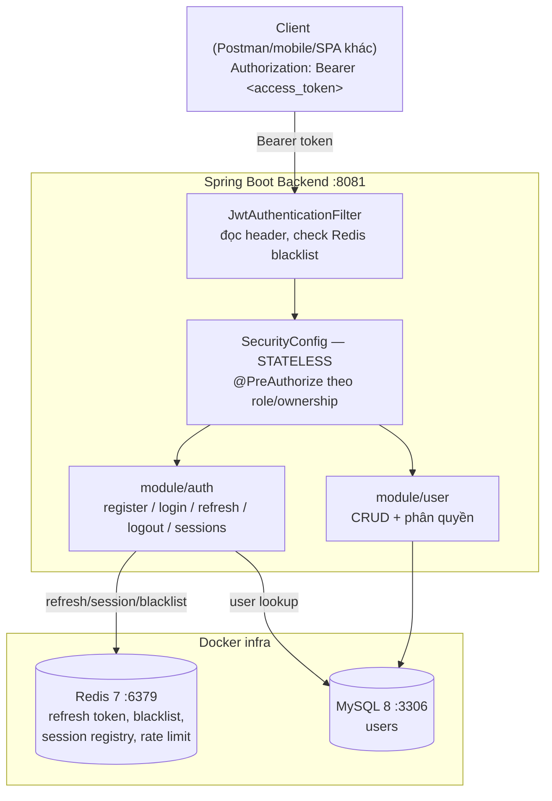

# Plan — Project 10: Spring Boot Blueprint

> **Loại tài liệu:** Kế hoạch (roadmap) — phản ánh những gì **đã quyết định**, chưa implement. Cập nhật lần cuối 2026-07-28.
> Khác với project 01–09 (mỗi project học 1 chủ đề), project 10 là **blueprint production-ready**: khung chuẩn để luyện viết REST API hoàn chỉnh với Spring Data JPA + Spring Security, đủ tiêu chuẩn làm nền cho dự án thực tế (chuẩn bị cho project ở trường).

---

## 1. Mục tiêu & Tại sao

- Luyện lại toàn bộ vòng đời viết API production, nhưng lần này **tự thiết kế từ đầu** thay vì follow theo hướng dẫn từng bước như 01–09.
- Có nền C#/Node.js-Express từ trước → tập trung vào phần **idiom riêng của Spring** (Spring Security filter chain, Spring Data JPA, DI qua constructor) thay vì học lại khái niệm REST/JWT cơ bản.
- 2 module trọng tâm: **`user`** (quản lý user, CRUD chuẩn) và **`auth`** (authentication nâng cao — JWT access + refresh token có Redis, rotation, reuse detection, multi-device session).
- So với JWT của project 06/09 (refresh token lưu **MySQL**): project 10 chuyển sang lưu ở **Redis** — TTL tự động hết hạn, không cần cron purge job (project 09 đang thiếu đúng job này, xem `backend/note.txt` của nó).

---

## 2. Tech Stack

| Concern | Lựa chọn | Ghi chú |
|---|---|---|
| Framework | Spring Boot 4.1.0 | Web MVC (`spring-boot-starter-webmvc`) |
| Ngôn ngữ | Java 21 | |
| Security | `spring-boot-starter-security` | JWT stateless thuần — **không** bật `oauth2Login()` (tránh session/CSRF churn đã gặp ở project 09) |
| JWT | JJWT `jjwt-api/impl/jackson` 0.13.0 | Đồng bộ version với project 09 |
| Persistence | `spring-boot-starter-data-jpa` + MySQL | Specification API cho filter động |
| Cache / Session store | `spring-boot-starter-data-redis` | Refresh token, access-token blacklist, rate limit, session registry |
| Validation | `spring-boot-starter-validation` | Bean Validation trên DTO |
| Docs | `springdoc-openapi-starter-webmvc-ui` (chưa thêm) | Swagger UI |
| Migration | `flyway-mysql` (chưa thêm) | Thay `ddl-auto: update` khi gần production |
| Test | Testcontainers (chưa thêm) | Integration test trên MySQL/Redis thật, không dùng H2 giả lập |

---

## 3. Cấu trúc package (đã chốt)

```
com/maaitlunghau/__spring_boot_blueprint/
├── common/            # dùng chung toàn app: ApiResponse, BaseEntity
├── config/             # SecurityConfig, CorsConfig, RedisConfig, OpenApiConfig
├── security/           # JwtService, JwtAuthenticationFilter, UserDetailsServiceImpl, entry point/access-denied handler
├── exception/          # GlobalExceptionHandler → ProblemDetail (RFC 7807)
├── filter/             # CorrelationIdFilter, RequestLoggingFilter
├── aspect/             # LoggingAspect (AOP)
├── scheduler/          # job định kỳ (vd purge soft-delete)
├── util/               # CookieUtils, DateUtils
└── module/
    ├── auth/    {controller/v1, service, repository, entity, dto/{request,response}, mapper}
    └── user/    {controller/v1, service/impl, repository/spec, entity, dto/{request,response}, mapper}
```

Quy ước: cái gì thuộc riêng 1 nghiệp vụ → `module/<tên>/`; cái gì dùng chung ≥ 2 module → package top-level. Interface service đặt thẳng trong `service/`, implementation trong `service/impl/` (không có folder tên `interface` — reserved keyword, không compile được).

---

## 4. Kiến trúc tổng quan



---

## 5. Lộ trình theo Phase

Thứ tự build (không làm tuần tự "xong hẳn auth rồi mới đụng user" — `auth` cần `User` entity tồn tại trước, `user` cần security wire xong mới bảo vệ được endpoint):

| Phase | Nội dung | Module |
|---|---|---|
| 1 | `User` entity + repository (chưa cần security) | user |
| 2 | Register + login + JWT access token (chưa refresh, chưa Redis) | auth |
| 3 | Wire `SecurityConfig` + `JwtAuthenticationFilter` toàn app — STATELESS | auth |
| 4 | Refresh token + Redis + rotation/reuse detection | auth |
| 5 | CRUD đầy đủ + `@PreAuthorize` theo role/ownership | user |
| 6 | Logout/blacklist, rate limit login, multi-device session | auth |
| 7 | Test (unit/slice/integration) cả 2 module | auth + user |
| 8 | Polish: OpenAPI, Flyway, exception handling nhất quán | cả 2 |

---

## 6. Chi tiết từng feature

### 6.1 · `auth` — JWT access token (Phase 2–3)

- Access token qua header **`Authorization: Bearer <token>`**, không dùng cookie (khác project 09 — project 10 là API thuần cho nhiều loại client, không gắn 1 SPA cụ thể).
- Claims tối thiểu: `sub` (email), `jti` (UUID — cần cho blacklist), `role`.
- Sign bằng HS256 (đủ dùng cho monolith 1 service; RS256 chỉ cần khi nhiều service verify token độc lập).
- `SecurityConfig`: `sessionCreationPolicy(STATELESS)` thuần — không bật `oauth2Login()` trừ khi thật sự cần social login sau này.

### 6.2 · `auth` — Refresh token qua Redis (Phase 4)

Refresh token là **chuỗi random opaque** (không phải JWT), hash SHA-256 trước khi dùng làm key — không lưu raw token ở đâu cả.

**Redis key design:**

| Key pattern | Value | TTL | Mục đích |
|---|---|---|---|
| `auth:refresh:{tokenHash}` | JSON `{userId, sessionId, deviceInfo, ip, issuedAt}` | = refresh token lifetime (vd 7 ngày) | Xác thực refresh token khi gọi `/refresh` |
| `auth:session:{userId}` | SET các `sessionId` đang active | không TTL (dọn khi revoke) | Liệt kê/thu hồi tất cả thiết bị của 1 user |
| `auth:blacklist:{jti}` | `"1"` | = thời gian còn lại của access token | Chặn access token bị logout dùng lại |
| `auth:ratelimit:login:{ip}` | counter | vd 60s | Chống brute-force login |

**Rotation + reuse detection:**
1. Mỗi lần `/refresh`: `GETDEL auth:refresh:{tokenHash}` (đọc + xoá atomic — tránh race condition 2 request refresh cùng lúc dùng chung token cũ).
2. Có giá trị → issue access + refresh token mới, ghi key mới.
3. Không có giá trị (token không tồn tại/đã dùng rồi) → nghi bị đánh cắp → xoá toàn bộ `auth:session:{userId}` (revoke hết mọi thiết bị), trả lỗi bắt login lại.

### 6.3 · `auth` — Logout & blacklist (Phase 6)

- `POST /api/v1/auth/logout`: đọc `jti` từ access token hiện tại → `SETEX auth:blacklist:{jti} <remaining-ttl> 1`; xoá refresh key + xoá khỏi `auth:session:{userId}`.
- `JwtAuthenticationFilter` check `EXISTS auth:blacklist:{jti}` trước khi set `SecurityContext`.

### 6.4 · `auth` — Nâng cao (Phase 6, optional)

- `GET /api/v1/auth/sessions` — liệt kê thiết bị đang đăng nhập (đọc `auth:session:{userId}`).
- `DELETE /api/v1/auth/sessions/{sessionId}` — thu hồi 1 thiết bị cụ thể ("đăng xuất từ xa" kiểu Facebook/Google).
- Rate limit login bằng Redis `INCR` + `EXPIRE`, hoặc `bucket4j-redis` nếu muốn chuẩn hơn.

### 6.5 · `user` — CRUD + phân quyền (Phase 1, 5)

- `User` entity extends `common/entity/BaseEntity`.
- Rule: email unique (check trước khi save), không cho tự đổi role của chính mình, không cho xoá ADMIN cuối cùng.
- Soft delete — nếu dùng, nhớ thêm purge job ở `scheduler/` (đừng lặp thiếu sót của project 09).
- `@PreAuthorize("hasRole('ADMIN')")` cho endpoint quản trị; `@PreAuthorize("#id == authentication.principal.id or hasRole('ADMIN')")` cho case "chính chủ hoặc admin".

---

## 7. Danh sách endpoint dự kiến

| Method | Path | Auth | Mô tả |
|---|---|---|---|
| POST | `/api/v1/auth/register` | public | Đăng ký |
| POST | `/api/v1/auth/login` | public | Đăng nhập, trả access + refresh token |
| POST | `/api/v1/auth/refresh` | refresh token | Rotate refresh, issue access token mới |
| POST | `/api/v1/auth/logout` | access token | Blacklist access token, xoá session hiện tại |
| GET | `/api/v1/auth/sessions` | access token | Liệt kê thiết bị đang đăng nhập |
| DELETE | `/api/v1/auth/sessions/{sessionId}` | access token | Thu hồi 1 thiết bị |
| GET | `/api/v1/users` | ADMIN | List + pagination + filter |
| GET | `/api/v1/users/me` | chính chủ | Xem profile bản thân |
| PATCH | `/api/v1/users/me` | chính chủ | Sửa profile bản thân |
| GET | `/api/v1/users/{id}` | ADMIN | Xem user khác |
| PATCH | `/api/v1/users/{id}` | ADMIN | Sửa user khác |
| DELETE | `/api/v1/users/{id}` | ADMIN | Xoá (soft delete) |

---

## 8. Quyết định cần chốt (đã khuyến nghị, có thể đổi)

| Quyết định | Khuyến nghị | Vì sao |
|---|---|---|
| Access token truyền qua đâu? | `Authorization: Bearer` header | API thuần, nhiều client — khác project 09 (cookie, vì đó là SPA cùng site) |
| Refresh token: JWT hay opaque? | Opaque random string, hash SHA-256 trước khi lưu Redis | Revoke tức thời được, không thể forge/decode như JWT |
| 1 session hay multi-device? | Multi-device (`auth:session:{userId}` là SET) | Điểm khác biệt "nâng cao" so với project 09 |
| Sign JWT bằng gì? | HS256 | Đủ cho monolith 1 service; RS256 chỉ cần khi nhiều service verify độc lập |

---

## 9. Checklist thực thi

- [ ] `User` entity + repository
- [ ] `common/dto/ApiResponse`, `common/entity/BaseEntity` — implement nội dung (hiện đang là class rỗng)
- [ ] Register + login + JWT access token
- [ ] `SecurityConfig` STATELESS + `JwtAuthenticationFilter`
- [ ] Refresh token qua Redis (rotation + reuse detection)
- [ ] `user` CRUD + `@PreAuthorize`
- [ ] Logout + blacklist
- [ ] Rate limit login
- [ ] Multi-device session list/revoke
- [ ] Test: unit (Mockito) / slice (`@WebMvcTest`, `@DataJpaTest`) / integration (`@SpringBootTest` + Testcontainers)
- [ ] Flyway migration đầu tiên, đổi `ddl-auto` sang `validate`
- [ ] OpenAPI/Swagger
- [ ] Điền nội dung `Dockerfile`, `docker-compose.yml`, `.env.example`, `.github/workflows/{ci,cd}.yml`

Checklist đầy đủ hơn (bao gồm phần hạ tầng/root file) xem thêm ở `projects/10-spring-boot-blueprint/README.md`.
